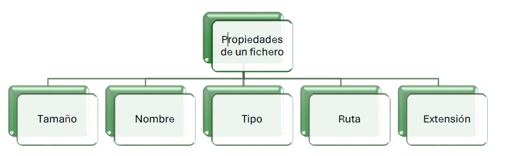
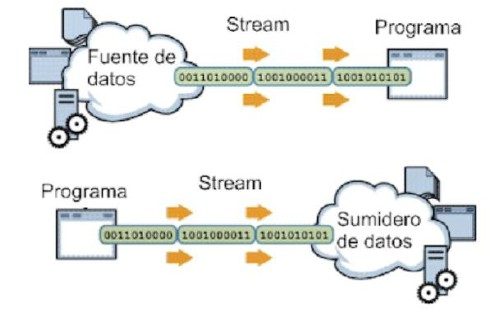
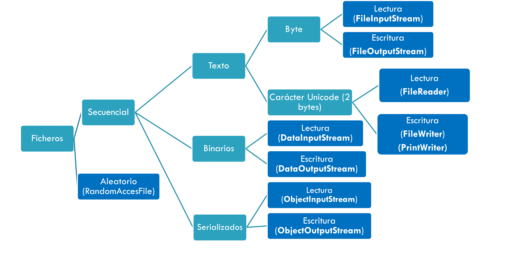
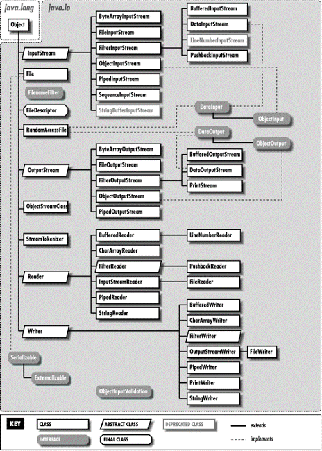
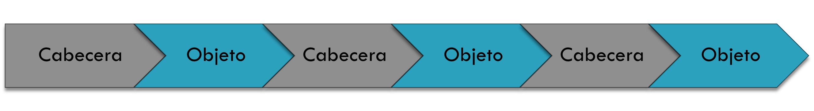
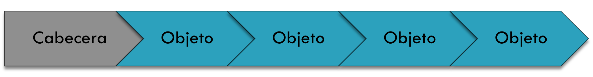

# UNIDAD 1. Acceso a datos almacenados en ficheros

- [UNIDAD 1. Acceso a datos almacenados en ficheros](#unidad-1-acceso-a-datos-almacenados-en-ficheros)
  - [Introducción](#introducción)
  - [Clases para trabajar con el sistema de ficheros](#clases-para-trabajar-con-el-sistema-de-ficheros)
    - [API java.io](#api-javaio)
    - [API java.nio](#api-javanio)
  - [Flujo de datos](#flujo-de-datos)
  - [Ficheros de texto](#ficheros-de-texto)
    - [Gestión de fichero de texto (Byte)](#gestión-de-fichero-de-texto-byte)
    - [Gestión de ficheros de texto (Línea a línea)](#gestión-de-ficheros-de-texto-línea-a-línea)
    - [Fichero de texto csv](#fichero-de-texto-csv)
      - [Clase StringTokenizer](#clase-stringtokenizer)
      - [Clase String](#clase-string)
    - [Ficheros de texto Json](#ficheros-de-texto-json)
      - [La librería Jackson](#la-librería-jackson)
        - [Métodos más utilizados de la librería Jackson](#métodos-más-utilizados-de-la-librería-jackson)
        - [Pasos para instalar la librería Jackson de Maven en NetBeans](#pasos-para-instalar-la-librería-jackson-de-maven-en-netbeans)
  - [Ficheros binarios](#ficheros-binarios)
    - [Ficheros para trabajar con datos primitivos](#ficheros-para-trabajar-con-datos-primitivos)
    - [Fichero para trabajar con Objetos. Serialización](#fichero-para-trabajar-con-objetos-serialización)
      - [Generar SerialVersionUID](#generar-serialversionuid)


## Introducción
**Un fichero** es un conjunto de bits almacenado en un dispositivo. Tienen nombre y se ubican en directorios. Ese nombre es único en el directorio.

Los ficheros tienen diferentes **extensiones** que indican **el tipo de contenido** y **formato**.


Existen diferentes `tipos de ficheros`:
- Ficheros de texto: almacenan caracteres, y se pueden leer con un editor de texto.
- Ficheros binarios: almacenan datos en formato binario, y no se pueden leer con un editor de texto.

Si el fichero almacena datos organizados en elementos, cada elemento se denomina registro y cada registro está compuesto por campos. 
La forma de agrupar los datos depende de la persona que lo diseñe.

Para trabajar con ficheros en Java existen diferentes APIs diferentes. Por un lado está la API `java.io`, y luego está la API `java.nio` y `java.nio2`.

## Clases para trabajar con el sistema de ficheros

### API java.io

Se introduce por primera vez en Java 1.0, actualmente consta de diferentes clases, pero nos vamos a centrar en la **clase File** que tiene específicamente para trabajar con el sistema de ficheros del sistema operativo:

- `File`: proporciona un conjunto de utilidades relacionadas con los ficheros que nos da información de los mismos y nos permite realizar acciones sobre ellos.

- `Constructores para File`: (Buscar en la API Java)
    - File(string directorioyFichero)
    - File(string directorio, string fichero)
- `Métodos importantes`:	
    - getName(), getPath(), getAbsolutePath(), getParent(), length(), createNewFile(), delete(), exists(), isDirectory(), isFile(), mkdir(), mkdirs(), renameTo(), list(), listFiles().
- `Otros métodos`
    - canExecute(), canRead(), canWrite(), setExecutable(boolean), isHidden(), lastModified(), setReadable(boolean), setWritable(boolean), setReadOnly()

Ejemplo: 

```java
File fichero=new File("prueba.txt");
if(fichero.exists()){
    System.out.println("El fichero existe");
}else{
    System.out.println("El fichero no existe");
}
```

**Ejemplo:** ejemploFile


### API java.nio

La API java.nio aparece para solucionar los problemas de la API java.io:

- La clase File carece de algunas funciones importantes, como un método de copia.
- También definió muchos métodos que devolvían valores booleanos, que en caso de error, se devolvía false, en lugar de lanzar una excepción, lo que dificulta saber por qué falló.
- No proporcionó un buen manejo en el soporte de enlaces simbólicos.
- Se proporciono un conjunto limitado de atributos de archivo.

Para solucionar estos problemas se introduce en Java 1.4 la API java New Input/Output (NIO) dentro del paquete java.nio. En Java 1.7 se actualiza java NIO introduciendo un nuevo paquete java.nio.file con el nombre de Java Non Blocking Input/Output (NIO2), que introduce:

- Files
- Path
- Paths
- FileSystem
- FileSystems

La **clase Paths** principalmente dispone del método estático get(Uri uri), que devuelve la instancia de un **objeto Path**. Con un objeto Path podemos gestionar la información relativa a la ruta o path de un fichero o de un directorio.
Mediante objetos de la clase  Path podemos usar métodos como:

- getFileName(): Devuelve el path extrayendo sólo nombre del elemento (fichero o carpeta)
- getParent(): Devuelve el Path de la carpeta que contiene al elemento.
- Iterator(): Aplicándose al path de una carpeta, devuelve un Iterator de objetos Path que apuntan a cada elemento contenido en la carpeta.

La **clase Files** perteneciente al paquete java.nio tiene muchos métodos estáticos para hacer múltiples operaciones con ficheros y directorios.
La clase Files tiene métodos para realizar:
1. Comprobaciones: 
    - Exists
    - notExists
    - isSameFile
    - isRegularFile
    - isReadable
    - isWritable
    - isExecutable
    - Etc.  
  
2. Manipulación de ficheros a nivel de sistema
    - Borrar (delete, deleteIfExists)
    - Copiar (copy)
    - Mover (move)
    - Para crear ficheros: Regulares (createFile) y Temporales (createTempFile)

3. La lectura y escritura con Java NIO de ficheros es mucho más sencilla:
    - Dispone de métodos que agilizan la lectura sobre ficheros de texto: readAllLines, lines, readString (desde Java 11)
    - Disponen de métodos más eficientes para instanciar flujos de caracteres
    - Para flujos de lectura (newBufferedReader). Ojo! No se trata del constructor
    - Para flujos de escritura (newBufferedWriter)
    - Disponen de métodos más eficientes para instanciar flujos de bytes
    - Para flujos de lectura (newInputStream)
    - Para flujos de escritura (newOutputStream)

4. Files también tiene métodos para trabajar con carpetas o directorios
    - Listar:	Contenido de directorios (newDirectoryStream, list, find, walk)
    - Crear: Crear un directorio (createDirectory, createDirectories) o directorio temporal (createTempDirectory)

**Ejemplo:** ejemploNIO

## Flujo de datos

Un **stream o flujo de datos** es un objeto que establece la conexión o vía de comunicación entre el programa y un dispositivo de entrada o de salida (teclado, pantalla, fichero, conexión de Internet). Los flujos nos permitirán introducir o sacar datos de nuestro sistema. Pueden ser de Entrada o de salida.



Ejemplos típicos:

- Lectura y escritura de ficheros.
- Entrada por teclado.
- Envío de datos por la red.
- Etc.

**Pasos para trabajar con Flujos**

1. Se abre el fichero
  - Para ello hay que crear un objeto de la clase correspondiente al tipo de fichero que vamos a manejar, y el tipo de acceso que vamos a utilizar:
  ```
	TipoDeFichero obj = new TipoDeFichero(ruta);
  ```
  - Donde `ruta` es la ruta de disco en que se encuentra el fichero o un descriptor de fichero válido.

2. Se utiliza el fichero
  - Para ello cada clase presenta diferentes métodos de acceso para escribir o leer en el fichero.

3. Gestión de excepciones (es opcional, pero recomendado).
  - Se puede observar que todos los métodos que utilicen clases de este paquete deben tener en su definición una cláusula throws IOException. Los métodos de estas clases pueden lanzar excepciones de esta clase (o sus hijas) en el transcurso de su ejecución, y dichas excepciones deben de ser capturadas y debidamente gestionadas para evitar problemas.
  
4. Se cierra el fichero y se destruye el objeto.
  - Para cerrar un fichero lo que hay que hacer es destruir el objeto. Esto se puede realizar de dos formas, dejando que sea el recolector de basura de Java el que lo destruya cuando no lo necesite (no se recomienda) o destruyendo el objeto explícitamente mediante el uso del método close() del objeto: obj.close().

**Tipos de ficheros en Java**

En Java es posible utilizar dos tipos de ficheros (de texto o binarios) y dos tipos de acceso a los ficheros (secuencial o aleatorio).



Las clases para trabajar con ficheros se encuentran en el paquete java.io, por lo que al principio del código fuente tendremos que escribir la sentencia import java.io.*;




## Ficheros de texto

### Gestión de fichero de texto (Byte)
Para trabajar con ficheros de texto en Java se utilizan las clases **FileInputStream** y **FileOutputStream** que permiten leer y escribir datos en formato byte.

Ejemplo: Escribir y leer caracteres en un fichero de texto

```java
File fichero = new File("mifichero.txt");
public static void escribirCaracteres(File fichero) {
  String frase;
  Scanner e = new Scanner(System.in);
  System.out.println("introduce la información que quieres grabar en el fichero");
  frase = e.nextLine();
  try (FileOutputStream fo = new FileOutputStream(fichero)) {
    for (int i = 0; i < frase.length(); i++) {
      fo.write(frase.charAt(i));
    }
  } catch (IOException ex) {
    System.err.println(ex.toString());
  }
}
public static void leerCaracteres(File fichero) {
  int caracter;
  try (FileInputStream fi = new FileInputStream(fichero)) {
    while ((caracter = fi.read()) != -1) {
      System.out.print((char) caracter);
    }
  } catch (IOException ex) {
    System.err.println(ex.toString());
  }
}
```
**Ejemplo:**byteAByte

:computer: Hoja de ejercicios 1

### Gestión de ficheros de texto (Línea a línea)

**Escritura de ficheros de texto línea a línea**.

Para escribir suele ser habitual hacer uso de la clase **BufferedWriter** que contiene métodos: write(String s) que nos permiten grabar String en un fichero. Si queremos **añadir al final de un fichero ya existente**, simplemente debemos poner un booleano a `true` como segundo parámetro del constructor de **FileWriter**.

```java
File fichero = new File("mifichero.txt");
public static void escribirLineaALinea(File fichero) {
  String frase;
  Scanner e = new Scanner(System.in);
  System.out.println("introduce la información que quieres grabar en el fichero");
  frase = e.nextLine();
  try ( BufferedWriter br = new BufferedWriter(new FileWriter(fichero, true));){
            br.write(frase);
            br.newLine();
  } catch (IOException ex) {
            System.err.println(ex.toString());
        }
}
```
**Lectura de ficheros de texto  línea a línea**

Podemos abrir un fichero de texto para leer usando la clase **FileReader**. Esta clase tiene métodos que nos permiten leer caracteres. Sin embargo, suele ser habitual querer las líneas completas, bien porque nos interesa la línea completa, bien para poder analizarla luego y extraer campos de ella. 

FileReader no contiene métodos que nos permitan leer líneas completas, pero sí **BufferedReader**.

Afortunadamente, podemos construir un BufferedReader a partir del FileReader de la siguiente forma:

```java
File archivo = new File ("C:\\archivo.txt");
FileReader fr = new FileReader (archivo);
BufferedReader br = new BufferedReader(fr);
...
String linea = br.readLine(); //permite leer una línea
```

Ejemplo: Mostramos por pantalla el contenido del fichero “mifichero.txt”. Para ello se leerá línea a línea todo el fichero:

```java
File fichero = new File("mifichero.txt");
public static void leerLineaALinea(File fichero) {
    String linea;
    try (BufferedReader br = new BufferedReader(new FileReader(fichero));) {
        while ((linea = br.readLine()) != null) { //detectar el final
            System.out.println(linea);
        }
    } 
    catch (FileNotFoundException e) {
      System.out.println(e.getMessage());
    }
    catch (IOException ex) {
          System.err.println(ex.toString());
        }
    }
```
**Ejemplo:** líneaALínea

Una forma alternativa a escribir en un fichero línea a línea es utilizando la clase **PrintWriter** que contiene métodos: 
- print(String s)
- println(String s) 
- o de otros tipos, 
que nos permiten grabar una línea e incluye el salto de línea al final en un fichero. 

Si queremos **añadir al final de un fichero ya existente**, simplemente debemos poner un booleano a `true` como segundo parámetro del constructor de FileWriter.
```java
Scanner sc = new Scanner(System.in);
File fichero = new File("mifichero.txt"); // si ya existe y queremos añadir es : new File("mifichero.txt", true)
  try ( PrintWriter salida= new PrintWriter(fichero); ) {
        String cadena;
        System.out.println("Introduce texto: para finalizar teclea FIN");
        cadena = sc.nextLine();
        while (!cadena.equalsIgnoreCase("FIN")) {
                salida.println(cadena);
                cadena = sc.nextLine();
            }
  } catch (FileNotFoundException e) {
      System.out.println(e.getMessage());
  } 
```
**Ejemplo:** printWriter

### Fichero de texto csv
Un **archivo CSV** (Comma-Separated Values) es un archivo de texto que utiliza comas para separar valores. Cada línea del archivo representa un registro o fila, y cada valor dentro de la línea representa un campo o columna. Los archivos CSV son ampliamente utilizados para almacenar datos tabulares y se pueden abrir y editar fácilmente con programas como Microsoft Excel, Google Sheets o cualquier editor de texto.

#### Clase StringTokenizer 
La clase **StringTokenizer** en Java proporciona un `método String tokenizador` para dividir una cadena en tokens según un delimitador específico. 
La cadena del tokenizador puede ser cualquier cadena que separe los tokens, como una 
coma, un punto y coma o un espacio en blanco. 
Usando el método tokenizer String de la clase StringTokenizer , podemos dividir una cadena en sus partes constituyentes. 
* Al llamar al **método nextToken()** , podemos recuperar cada token por turno
* Al usar el **método hasMoreTokens()** , podemos verificar si quedan más tokens. 
* El **método length()** de la clase StringTokenizer se puede utilizar para obtener la longitud de cada token. 

StringTokenizer String es una herramienta útil para la manipulación de cadenas y se puede utilizar para analizar `archivos CSV`, URL u otros datos basados ​​en texto. 

La clase StringTokenizer es parte del paquete Java.util y proporciona una forma sencilla de dividir una cadena en tokens. 

La clase tiene dos constructores, uno que toma una cadena para tokenizar y un carácter o cadena delimitador, y otro que toma los mismos argumentos así como un indicador booleano que indica si se incluye o no el delimitador como token. 

Una vez que haya creado un objeto StringTokenizer, puede utilizar sus diversos métodos para recorrer los tokens y realizar diversas operaciones con ellos. 

Ejemplo: Leer una cadena que caracteres y obtener todas las palabras que la componen

```java
  String input = "Hola Mundo! Cómo te encuentras hoy?";
  StringTokenizer tokenizer = new StringTokenizer(input, " ");
  while (tokenizer.hasMoreTokens()) {
      String token = tokenizer.nextToken();
      System.out.println("Palabra: " + token + " Longitud: " + token.length());
  }
```
La salida de la información es 
```
Palabra: Hola Longitud: 4
Palabra: Mundo! Longitud: 6
Palabra: Cómo Longitud: 4
Palabra: te Longitud: 2
Palabra: encuentras Longitud: 10
Palabra: hoy? Longitud: 4
```
#### Clase String
La clase **String** en Java es una clase incorporada que representa una secuencia de caracteres.
**Método split()**:
El método split() de la clase String se utiliza para dividir una cadena en subcadenas basadas en un delimitador específico. Este método devuelve una matriz de cadenas que contiene las subcadenas resultantes.

Ejemplo: Leer una cadena de caracteres y obtener todas las palabras que la componen usando split()

```java
  String input = "Hola Mundo! Cómo te encuentras hoy?";
  String[] palabras = input.split(" ");
  for (String palabra : palabras) {
      System.out.println("Palabra: " + palabra + " Longitud: " + palabra.length());
  }
```
Obtenemos la misma salida con la Clase String que si utilizamos la clase StringTokenizer

**Ejemplo:** EjemploCSV

### Ficheros de texto Json

Un **archivo JSON** (JavaScript Object Notation) es un archivo de texto que almacena datos estructurados en formato de objetos y arrays, utilizando una sintaxis basada en pares clave-valor. Es ampliamente utilizado para el intercambio de información entre aplicaciones, especialmente en entornos web y APIs, por su facilidad de lectura tanto para humanos como para máquinas.

Ejemplo: Leer y procesar un archivo JSON como texto plano (sin librerías externas). A continuación figura el contenido del fichero Json `palabras.json`:

```json
{
  "palabras": [
    {"texto": "Hola"},
    {"texto": "Mundo!"},
    {"texto": "Cómo"},
    {"texto": "te"},
    {"texto": "encuentras"},
    {"texto": "hoy?"}
  ]
}
```

```java
import java.io.BufferedReader;
import java.io.FileReader;

public class EjemploTextoPlanoJSON {
  public static void main(String[] args) {
    try (BufferedReader br = new BufferedReader(new FileReader("palabras.json"))) {
      String linea;
      while ((linea = br.readLine()) != null) {
        if (linea.trim().startsWith("{\"texto\":")) {
          String palabra = linea.trim().replace("{\"texto\": \"", "")
                        .replace("\"},", "")
                        .replace("\"}", "");
          System.out.println("Palabra: " + palabra + " Longitud: " + palabra.length());
        }
      }
    } catch (Exception e) {
      System.out.println("Error al leer el archivo: " + e.getMessage());
    }
  }
}
```
#### La librería Jackson
Jackson es una biblioteca popular de Java para procesar datos JSON (JavaScript Object Notation). Proporciona una forma sencilla y eficiente de convertir objetos Java a JSON y viceversa. Jackson es ampliamente utilizado en aplicaciones web y servicios RESTful para manejar la serialización y deserialización de datos JSON.

Partiendo del fichero `palabras.json` realizamos el mismo ejercicio pero utilizando la librería Jackson: 

```java
import com.fasterxml.jackson.databind.JsonNode;
import com.fasterxml.jackson.databind.ObjectMapper;
import java.io.FileInputStream;
import java.io.IOException;
import java.io.File;
import java.io.IOException;

public class EjemploJackson {
  public static void main(String[] args) {
    ObjectMapper mapper = new ObjectMapper();
    try (FileInputStream fis = new FileInputStream("palabras.json")) {
      JsonNode root = mapper.readTree(fis);
      JsonNode palabrasArray = root.get("palabras");
      if (palabrasArray != null && palabrasArray.isArray()) {
        for (JsonNode palabraNode : palabrasArray) {
          JsonNode textoNode = palabraNode.get("texto");
          if (textoNode != null) {
            String palabra = textoNode.asText();
            System.out.println("Palabra: " + palabra + " Longitud: " + palabra.length());
          } else {
            System.out.println("Error: El nodo 'texto' no existe en una de las palabras.");
          }
        }
      } else {
        System.out.println("Error: El nodo 'palabras' no existe o no es un array.");
      }
    } catch (IOException e) {
      System.out.println("Error al leer el archivo JSON: " + e.getMessage());
    } catch (Exception e) {
      System.out.println("Error inesperado: " + e.getMessage());
    }
  }
}
```
Hemos tenido que importar dos clases `JsonNode` y `ObjectMapper` del paquete `com.fasterxml.jackson.databind`

**¿Qué hacen estas clases?**

- **ObjectMapper**: Es la clase principal de Jackson para convertir entre objetos Java y JSON. Permite serializar objetos Java a JSON y deserializar JSON a objetos Java. También proporciona métodos para leer y escribir árboles JSON.

- **JsonNode**: Representa un nodo en el árbol JSON. Permite navegar y acceder a los datos de un JSON de forma estructurada, como si fuera un árbol, facilitando la lectura de valores, arrays y objetos dentro del JSON.

En el ejemplo, `ObjectMapper` se usa para leer el texto JSON y convertirlo en un árbol de nodos `JsonNode`, que luego se recorre para acceder a cada palabra y su longitud.

##### Métodos más utilizados de la librería Jackson

**ObjectMapper:**
- `readTree(File/String/InputStream)`: Lee un JSON y lo convierte en un árbol de nodos JsonNode.
- `readValue(File/String/InputStream, Class)`: Convierte un JSON en un objeto Java.
- `writeValue(File, Object)`: Escribe un objeto Java como JSON en un archivo.
- `writeValueAsString(Object)`: Convierte un objeto Java a una cadena JSON.
- `enable(SerializationFeature)`, `disable(DeserializationFeature)`: Configura opciones de serialización/deserialización.

**JsonNode:**
- `get(String fieldName)`: Obtiene el valor de un campo específico.
- `asText()`, `asInt()`, `asBoolean()`: Convierte el valor del nodo al tipo correspondiente.
- `isArray()`, `isObject()`: Verifica el tipo de nodo.
- `size()`: Devuelve el número de elementos en un array o campos en un objeto.
- `iterator()`: Permite recorrer los elementos de un array o los campos de un objeto.

**Ventajas de utilizar la librería Jackson:**

- Permite trabajar directamente con estructuras de datos complejas (objetos, listas, mapas) en formato JSON, facilitando la manipulación y acceso a la información.
- Realiza la conversión automática entre JSON y objetos Java, evitando el procesamiento manual de cadenas y delimitadores.
- Es más seguro y menos propenso a errores, ya que valida la estructura del JSON y detecta inconsistencias.
- Facilita la integración con APIs y servicios web que utilizan JSON como formato de intercambio.
- Permite navegar y modificar el árbol de datos de forma sencilla usando clases como JsonNode.
- Soporta serialización y deserialización avanzada, incluyendo tipos genéricos, fechas y formatos personalizados.

##### Pasos para instalar la librería Jackson de [Maven](https://mvnrepository.com/) en NetBeans

1. **Abrir NetBeans y tu proyecto Maven**
  - Inicia NetBeans y abre el proyecto Maven donde deseas usar Jackson.

2. **Editar el archivo `pom.xml`**
  - Haz doble clic en el archivo `pom.xml` de tu proyecto para abrirlo.

3. **Agregar la dependencia de Jackson**
  - Dentro de la sección `<dependencies>`, añade el siguiente bloque:

    ```xml
    <!-- https://mvnrepository.com/artifact/com.fasterxml.jackson.core/jackson-databind -->
    <dependency>
      <groupId>com.fasterxml.jackson.core</groupId>
      <artifactId>jackson-databind</artifactId>
      <version>2.20.0</version>
    </dependency>
    ```

  - Para la mayoría de los casos, solo necesitas agregar la dependencia `jackson-databind` en tu `pom.xml`. Esta dependencia incluye automáticamente `jackson-core` y `jackson-annotations` como dependencias transitivas, por lo que no es necesario añadirlas manualmente.

4. **Guardar los cambios**
  - Guarda el archivo `pom.xml`.

5. **Actualizar las dependencias del proyecto**
  - Haz clic derecho sobre el proyecto en el panel de proyectos y selecciona `Actualizar proyecto` o `Build with Dependencies`.

6. **Verificar la instalación**
  - Comprueba que la carpeta `Dependencies` del proyecto incluye `jackson-databind`.

:computer: Hoja de ejercicios 2

## Ficheros binarios

### Ficheros para trabajar con datos primitivos
Para trabajar con ficheros binarios en Java se utilizan las clases **DataInputStream** y **DataOutputStream** 
que permiten leer y escribir datos primitivos (int, char, float, double, etc.) en formato binario.
El final del fichero al usar la clase **DataInputStream** se lanza una excepción `EOFException`al intenar leer más allá del final.

Ejemplo: Escribir y leer datos primitivos en un fichero binario

```java
File fichero = new File("datos.dat");

public static void escribirDatos(File fichero) {
  try (DataOutputStream dos = new DataOutputStream(new FileOutputStream(fichero))) {
    dos.writeInt(25);
    dos.writeDouble(3.14);
    dos.writeChar('A');
    dos.writeUTF("Hola Mundo");
  } catch (IOException ex) {
    System.err.println(ex.toString());
  }
}

public static void leerDatos(File fichero) {
  try (DataInputStream dis = new DataInputStream(new FileInputStream(fichero))) {
    while (true) {
      int entero = dis.readInt();
      double real = dis.readDouble();
      char caracter = dis.readChar();
      String cadena = dis.readUTF();
      System.out.println("Entero: " + entero);
      System.out.println("Real: " + real);
      System.out.println("Caracter: " + caracter);
      System.out.println("Cadena: " + cadena);
    }
  } catch (EOFException eof) {
    // Fin del fichero, salida normal
  } catch (IOException ex) {
    System.err.println(ex.toString());
  }
}
```
**Ejemplo:** EjemploBinario

### Fichero para trabajar con Objetos. Serialización

El hecho de poder guardar objetos en ficheros recibe el nombre de **Persistencia**. Para poder almacenar objetos de una clase en un fichero se necesita que la clase implemente la interfaz **Serializable**, y así los objetos se podrán guardar en ficheros. La interfaz Serializable no tiene ningún método para implementar, pero es obligatorio implementarlo para poder guardar objetos en un fichero.

Los flujos que se utilizan para la lectura y escritura de ficheros de objetos son **ObjectInputStream** y **ObjectOutputStream**.

Los métodos a utilizar son:

- public Object readObject();
- public void writeObject(Object obj);

Vemos un ejemplo. Empezamos con la clase Coche:

```java
public class Coche implements Serializable {

    private String marca;
    private double velocidad;
    private int gasolina;

    public Coche(String marca, double velocidad, int gasolina) {
        this.marca = marca;
        this.velocidad = velocidad;
        this.gasolina = gasolina;

    }

    @Override
    public String toString() {
        return "Coche{" + "marca=" + marca + ", velocidad = " 
                + velocidad + ", gasolina =" + gasolina + '}';
    }
}
```

El método escribir un objeto en el fichero:

```java
public static void Escribir(File fichero) {
  ObjectOutputStream fo = null;
  String marca="";
  double velocidad;
  int gasolina;
  try {
    if(fichero.exists()){
      fo=new MiObjectOutputStream(new FileOutputStream(fichero,true));
    }else{
      fo = new ObjectOutputStream(new FileOutputStream(fichero));
    }
    marca=Teclado.pedirMarca();
    velocidad=Teclado.pedirVelocidad();
    gasolina=Teclado.pedirGasolina();
    Coche c = new Coche(marca,velocidad,gasolina);
    fo.writeObject(c);
  } catch (IOException ex) {
    System.err.println(ex.toString());
  } finally {
    if (fo != null) {
      try {
        fo.close();
      } catch (IOException ex) {
        System.out.println("Error al cerrar el fichero");
      }
    }
  }
}
```

El método leer los objetos de un fichero:

```java
public static void leerFichero(File fichero) {
  boolean fin = false;
  try (ObjectInputStream os = new ObjectInputStream(new FileInputStream(fichero));) {
      Coche coche;
      while (!fin) {
          coche = (Coche) os.readObject();//Casting necesario 
          System.out.println(coche.toString());
      }
  } catch (EOFException e) {
      //termina la lectura del fichero
      fin=true; //no es necesario 
  } catch (ClassNotFoundException e) {
      System.out.println("Error el tipo de objeto no es compatible");
  } catch (FileNotFoundException e) {
      System.out.println("No se encontró el archivo");
  } catch (IOException e) {
      System.out.println("Error " + e.getMessage());
  }    
}

```

Si nos fijamos en el ejemplo de escritura realizamos distinta acción en función de si el fichero ya está creado y esto es debido a como trabaja la clase ObjectOutputStream. Cada vez que se crea un objeto ObjectOutputStream y escribimos en él, se escribe en el fichero una cabecera (para identificar el tipo de objeto serializado).
Si llamaramos varias veces a nuestro método escribirCoche anterior nos escribirá algo así en el fichero:



Al leer del fichero intentará realizar lo siguiente:



El primer objeto lo leerá bien, pero al intentar leer el 2º, cogerá una cabecera, intentará convertirlo a objeto y dará un error.

¿Se os ocurre alguna solución? Posiblemente lo más sencillo sea mirar si existe el fichero. En caso que no exista, que cree cabeceras y si ya existe, que escriba únicamente objetos, sin cabeceras.

Para la opción 1, en caso de que no exista el fichero, crearemos un objeto ObjectOutputStream.
Para la opción 2, en caso que el fichero ya exista, crearemos un objeto ObjectOutputStream `Sin Cabeceras`. Es una clase que tendremos que añadir a nuestros ejercicios que hereda de ObjectOutputStream, y lo único que hace es sobreescribir el método que imprime las cabeceras en el fichero. Si dejamos ese método vacío, no escribirá ninguna cabecera en el fichero. En el ejemplo anterior la hemos denominado **MiObjectOutputStream**

Vemos el ejercicio completo en el siguiente ejemplo.

**Ejemplo:** EjemploSerializable

#### Generar SerialVersionUID

Es importante declarar el atributo **serialVersionUID** dentro de cualquier clase que implemente **Serializable**
1. **serialVersionUID**. Se utiliza para indicar la versión de los datos serializados.
2. Cuando no declaramos **serialVersionUID** en nuestra clase, el tiempo de ejecución de Java lo hace por nosotros, pero este proceso es sensible a muchos metadatos de la clase, incluido el número de campos, el tipo de campos, los modificadores de acceso a los campos, las interfaces que se implementan en la clase. , etc. Puedes encontrar la información exacta en la documentación de serialización de Oracle.
3. Se recomienda declarar **serialVersionUID** como una variable larga final estática privada para evitar el mecanismo predeterminado.

> cuando hemos creado un fichero serializable  y lo queremos leer en otra ejecución del programa es obligatorio definir el atributo en la clase. Por ejemplo,  private static final long serialVersionUID=5056103125083778370L

:computer: Hoja de ejercicios 3