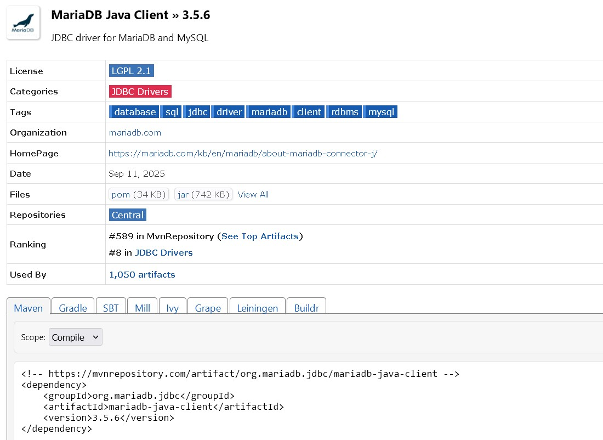

# UNIDAD 2. Acceso a bases de datos relacionales mediante conectores
- [UNIDAD 2. Acceso a bases de datos relacionales mediante conectores](#unidad-2-acceso-a-bases-de-datos-relacionales-mediante-conectores)
  - [INTRODUCCIÓN](#introducción)
    - [JDBC](#jdbc)
      - [COMPONENTES DEL JDBC](#componentes-del-jdbc)
        - [DRIVERS](#drivers)
  - [EL DESFASE OBJETO RELACIONAL](#el-desfase-objeto-relacional)
  - [CLASIFICACIÓN DE LAS BASES DE DATOS RELACIONALES](#clasificación-de-las-bases-de-datos-relacionales)
  - [PASO 1: AÑADIR EL DRIVER AL PROYECTO JAVA MAVEN](#paso-1-añadir-el-driver-al-proyecto-java-maven)
    - [SQLite](#sqlite)
    - [MariaDB](#mariadb)
    - [MySQL](#mysql)
  - [PASO 2 - ESTABLECER CONEXIÓN](#paso-2---establecer-conexión)
    - [SQLite](#sqlite-1)
    - [MariaDB](#mariadb-1)
    - [MySQL](#mysql-1)
  - [PASO 3 - CLASES PARA MANIPULAR LAS BASES DE DATOS](#paso-3---clases-para-manipular-las-bases-de-datos)
    - [construcción de un objeto gestor de instrucciones](#construcción-de-un-objeto-gestor-de-instrucciones)
    - [Métodos de `Statement` para ejecutar sentencias SQL](#métodos-de-statement-para-ejecutar-sentencias-sql)
      - [`int executeUpdate(String sentenciaSQL)`](#int-executeupdatestring-sentenciasql)
      - [`ResultSet executeQuery(String sentenciaSQL)`](#resultset-executequerystring-sentenciasql)
      - [`boolean execute(String sentenciaSQL)`](#boolean-executestring-sentenciasql)
      - [`Resulset getResultSet()`](#resulset-getresultset)
        - [Métodos para obtener datos de columna de la fila seleccionada. Métodos getXXX.](#métodos-para-obtener-datos-de-columna-de-la-fila-seleccionada-métodos-getxxx)
    - [Construcción de un objeto PreparedStatement](#construcción-de-un-objeto-preparedstatement)
    - [Métodos de `PreparedStatement` para ejecutar sentencias SQL](#métodos-de-preparedstatement-para-ejecutar-sentencias-sql)
      - [`int executeUpdate()`](#int-executeupdate)
      - [`ResultSet executeQuery()`](#resultset-executequery)
      - [`boolean execute()`](#boolean-execute)
      - [`Resulset getResultSet()`](#resulset-getresultset-1)
    - [Actualización de datos mediante un `ResultSet`](#actualización-de-datos-mediante-un-resultset)
      - [Insertar filas](#insertar-filas)
      - [Modificar filas](#modificar-filas)
      - [Eliminar filas](#eliminar-filas)
  - [GESTIÓN DE TRANSACCIONES](#gestión-de-transacciones)
  - [CONTROL DE ERRORES](#control-de-errores)
    - [Métodos de SQLException](#métodos-de-sqlexception)
  - [EJECUCIÓN DE SCRIPTS](#ejecución-de-scripts)
    - [transacciones](#transacciones)
      - [Ejemplo completo de ejecución de script con control de transacciones:](#ejemplo-completo-de-ejecución-de-script-con-control-de-transacciones)
  - [EJECUCION DE PROCEDIMIENTOS ALMACENADOS](#ejecucion-de-procedimientos-almacenados)
    - [Crear un procedimiento almacenado](#crear-un-procedimiento-almacenado)
    - [Llamar a un procedimiento almacenado desde Java](#llamar-a-un-procedimiento-almacenado-desde-java)
      - [Ejemplo completo con la tabla productos](#ejemplo-completo-con-la-tabla-productos)
      - [1. Crear procedimiento para gestión de productos (MySQL)](#1-crear-procedimiento-para-gestión-de-productos-mysql)
      - [2. Llamada al procedimiento desde Java](#2-llamada-al-procedimiento-desde-java)

## INTRODUCCIÓN

Actualmente, las bases de datos relacionales siguen siendo uno de los sistemas de almacenamiento más extendidos, aunque otros sistemas se estén abriendo paso poco a poco.

Una base de datos relacional se puede definir, de una manera simple, como aquella que presenta la información en tablas con filas y columnas.

Una tabla o relación es una colección de objetos del mismo tipo (filas o tuplas).

En cada tabla de una base de datos se elige una clave primaria para identificar de manera unívoca a cada fila.

El sistema gestor de bases de datos Database Management System (DBMS) gestiona el modo en que los datos se almacenan, mantienen y recuperan.

**CONECTORES**: software que se necesita para realizar las conexiones desde nuestro programa java a la base de datos relacional.

Para establecer una conexión a una base de datos relacional en Java, primero debes hacer uso de __JDBC__. 
__JDBC__ es un conjunto de clases e interfaces que permiten a los desarrolladores Java acceder y manipular bases de datos relacionales.

Para realizar la conexión a una base de datos desde Java necesitas hacer uso de __JDBC__ y de un __driver__ específico para cada SGBD que se utilice. Una vez establecida la conexión ya puedes interrogar la BD con cualquier comando SQL (select, update, create, etc.)

### JDBC

* __JDBC__ Son las siglas de `Java Database Connectivity`
* Consta de un conjunto de clases e interfaces Java que nos  permiten acceder de una forma genérica a las bases de  datos independientemente del proveedor del SGBD
* Define una arquitectura estándar para que cada fabricante (MySQL, Oracle, etc.)  pueda crear los drivers que permitan a los programas en Java acceder a los datos


* JDBC nos permite escribir aplicaciones Java para gestionar las siguientes tareas con una base de datos relacional:
  * __Conectarse__ a la base de datos (local o remota)
  * __Enviar consultas e instrucciones de actualización__ a la base de  datos
  * __Recuperar y procesar los resultados__ recibidos de la base de datos en respuesta a las consultas

* Se encuentra dentro del paquete `java.sql` . [Documentación oficial](https://docs.oracle.com/javase/8/docs/api/java/sql/package-summary.html)

#### COMPONENTES DEL JDBC
* El gestor de los drivers (java.sql.DriverManager)
* La conexión con la base de datos (java.sql.Connection)
* La sentencia a ejecutar (java.sql.Statement)
* Sentencias preparadas (java.sql.PreparedStatement)
* El resultado (java.sql.ResulSet)


##### DRIVERS

* Llamamos __Drivers__ al conjunto de clases que implementan las interfaces JDBC.
* **El driver** proporciona la comunicación entre la aplicación Java y la base de datos.
* Cada tipo de bases de datos (Oracle, MySQL,  PostGreSQL, etc) tienen su propio driver.
* Los drivers los proporcionan los fabricantes de las  bases de datos. Normalmente se descarga desde la  página web del fabricante.
  


## EL DESFASE OBJETO RELACIONAL

* El modelo relacional y el modelo orientado a objetos son dos paradigmas diferentes para representar y gestionar datos.
* NO podemos almacenar objetos en una tabla de una base de datos relacional.
* En su lugar almacenaremos cada uno de los datos miembro de un objeto, uno a uno.
* Al escribir en la base de datos tendremos que descomponer un objeto en cada uno de sus datos. Al leer de la base de datos, leeremos varias columnas y de cada fila podremos montar un objeto con los datos leídos.

## CLASIFICACIÓN DE LAS BASES DE DATOS RELACIONALES
* __Bases de datos cliente/servidor__ / __Empresariales__: son las que utilizan un servidor de bases de datos que gestiona las peticiones de los clientes. Ejemplos: MySQL, PostgreSQL, Oracle, SQL Server.

* __Bases de datos embebidas__ / __ligeras__:
  * Una base de datos embebida es una base de datos que se integra directamente en una aplicación o sistema, en lugar de ser un sistema independiente.
  * Se utilizarán si no se almacenan grandes cantidades de información.
  * El motor de almacenamiento está inscrustado en la aplicación y es exclusivo para ella.
  * La BD se inicia al comenzar la aplicación y termina cuando se cierra la aplicación.
  * Casi todas son OpenSource


Algunas bases de datos relacionales embebidas son:
* [H2 Database](https://www.h2database.com/html/main.html)
* [SQLite](https://www.sqlite.org/)
* [Apache Derby](https://db.apache.org/derby/)
* [Firebird](https://firebirdsql.org/)

:computer: Actividad 1

## PASO 1: AÑADIR EL DRIVER AL PROYECTO JAVA MAVEN

### SQLite
Añadir `la librería SQLite JDBC` lo mejor es ir al [repositorio de maven](https://mvnrepository.com/) y buscar el conector para [SQLite JDBC](https://mvnrepository.com/artifact/org.xerial/sqlite-jdbc)


Añadir la dependencia al archivo `pom.xml`

```xml
   <dependencies>
        <!-- https://mvnrepository.com/artifact/org.xerial/sqlite-jdbc -->
        <dependency>
            <groupId>org.xerial</groupId>
            <artifactId>sqlite-jdbc</artifactId>
            <version>3.50.3.0</version>
        </dependency>
    </dependencies>
```
### MariaDB
Para añadir el conector de MariaDB a un proyecto Maven, lo mejor es ir al [repositorio de maven](https://mvnrepository.com/) y buscar el conector para [MariaDB Connector/J](https://mvnrepository.com/artifact/org.mariadb.jdbc/mariadb-java-client)

Añadir la dependencia al archivo `pom.xml`

```xml
   <dependencies>
        <!-- https://mvnrepository.com/artifact/org.mariadb.jdbc/mariadb-java-client -->
        <dependency>
            <groupId>org.mariadb.jdbc</groupId>
            <artifactId>mariadb-java-client</artifactId>
            <version>3.5.6</version>
        </dependency>
    </dependencies>
```

### MySQL
Para añadir el conector de MySQL a un proyecto Maven, lo mejor es ir al [repositorio de maven](https://mvnrepository.com/) y buscar el conector para [MySQL Connector/J](https://mvnrepository.com/artifact/mysql/mysql-connector-java)


Añadir la dependencia al archivo `pom.xml`

```xml
   <dependencies>
        <!-- https://mvnrepository.com/artifact/mysql/mysql-connector-java -->
        <dependency>
            <groupId>mysql</groupId>
            <artifactId>mysql-connector-java</artifactId>
            <version>8.0.29</version>
        </dependency>
    </dependencies>
```
O bien descargar el conector desde la [página oficial de MySQL](https://dev.mysql.com/downloads/connector/j/) y añadirlo al proyecto.

* El JAR del conector para la versión que requieras, por ejemplo la 8.0.29
* Abrir el proyecto e ir al directorio __Dependencies__
* Y situados en ese directorio con botón derecho aparece la opción


* Una vez añadido aparece


* En el fichero POM.XML, aparece la dependencia añadida
  


## PASO 2 - ESTABLECER CONEXIÓN
Debemos especificar el origen de datos ( cual es la base de datos).**El origen de datos** se especifica con una URL que tiene un formato para cada SGBD. 

### SQLite

```
jdbc:sqlite:ruta_fichero_bd
```
donde `ruta_fichero_bd` es la ruta del fichero donde se encuentra la base de datos. Si el fichero no existe se crea automáticamente.

Con esa URL de origen de datos, mediante el **método getConnection**, obtenemos un objeto de conexión con la base de datos (Connection) que es indispensable para poder trabajar con ella.

Ejemplo:
```java
Connection conexion=null;
String url = "jdbc:sqlite:C:/basesdedatos/mi_basedatos.db";
try{
    conexion = DriverManager.getConnection(url);
    if (conexion != null) {
        System.out.println("Conexión establecida");
    }
    
}catch(SQLException |ClassNotFoundException e){
    System.out.println(e.getMessage());
}

```
### MariaDB

```
jdbc:mariadb://host:puerto/nombre_base_datos
```
donde:
* `host` es el nombre del servidor donde se encuentra la base de datos (localhost si es en el mismo equipo)
* `puerto` es el puerto por donde escucha la base de datos
* `nombre_base_datos` es el nombre de la base de datos a la que nos queremos conectar

El SBGB debe estar arrancado y la base de datos creada. Además también según el sistema de autenticación que tenga debemos introducir el usuario y la clave de conexión

Ejemplo:
```java

Connection conexion=null;
String url = "jdbc:mariadb://localhost:3306/mi_basedatos";
try{
    conexion = DriverManager.getConnection(url,"usuario","clave");
    if (conexion != null) {
        System.out.println("Conexión establecida");
    }

```

### MySQL

```
jdbc:mysql://host:puerto/nombre_base_datos
```
donde:
* `host` es el nombre del servidor donde se encuentra la base de datos (localhost si es en el mismo equipo)
* `puerto` es el puerto por donde escucha la base de datos
* `nombre_base_datos` es el nombre de la base de datos a la que nos queremos conectar

El SBGB debe estar arrancado y la base de datos creada.

__El patrón Singleton__ en Java es un patrón de diseño que garantiza que tan solo exista un objeto de su tipo y proporciona un único punto de acceso a él para cualquier otro código.
En acceso a datos, el Singleton es muy útil para:

* Gestores de conexión: Una sola instancia maneja todas las conexiones
* Configuración de BD: Una instancia única con los parámetros de conexión
* Pool de conexiones: Control centralizado de las conexiones disponibles

```java
/*
 * sigue el patrón Singleton para la conexión a la base de datos
 */
package cic.ejemplos09.ejemplo1;

import java.sql.Connection;
import java.sql.DriverManager;
import java.sql.ResultSet;
import java.sql.SQLException;
import java.sql.Statement;
import java.util.Properties;

/**
 *
 * @author cic
 */
public class AccesoBaseDatos {

    private Connection conn = null; //atributo conexión
    // constantes a definir
    private static final String BD = "ejemplo";
    private static final String USUARIO = "conexion";
    private static final String CLAVE = "";
    private static final String URL = "jdbc:mysql://localhost:3306/" + BD;

    private AccesoBaseDatos() {
        
        try {
            Properties properties = new Properties();
            properties.setProperty("user", USUARIO);
            properties.setProperty("password", CLAVE);
            properties.setProperty("useSSL", "false");
            properties.setProperty("autoReconnect", "true");
            conn = (Connection) DriverManager.getConnection(URL, properties);
            if (conn == null) {
                System.out.println("Error en conexion");
            } else {
                System.out.println("Conexion correcta a: " + URL);
            }
        } catch (SQLException ex) {
            // handle any errors
            System.out.println("SQLException: " + ex.getMessage());
            System.out.println("SQLState: " + ex.getSQLState());
            System.out.println("VendorError: " + ex.getErrorCode());
        }
    }

    public static AccesoBaseDatos getInstance() {
        return AccesoBaseDatosHolder.INSTANCE;
    }

    private static class AccesoBaseDatosHolder {

        private static final AccesoBaseDatos INSTANCE = new AccesoBaseDatos();
    }

    // método obtener la conexión
    public Connection getConexion() {
        return conn;
    }
    
    // método para cerrar la conexión a la bd
    public boolean cerrar() {
        boolean siCerrada = false;
        try {
            conn.close();
            if (conn.isClosed()) {
                siCerrada = true;
            }
        } catch (SQLException sqe) {
            System.out.println("Se produjo un error en el cierre"+sqe.getMessage());
        }
        return siCerrada;
    }

```
para acceder a la conexión de la base de datos:
```java
Connection conn = AccesoBaseDatos.getInstance().getConexion();
```

## PASO 3 - CLASES PARA MANIPULAR LAS BASES DE DATOS

Los objetos gestores de instrucciones SQL permiten ejecutar instrucciones SQL. 
Se construyen a partir de un objeto de **la clase Connection**.

Una vez construido un gestor de instrucciones podemos ejecutar instrucciones con varios métodos.

### construcción de un objeto gestor de instrucciones

Hay dos clases gestoras de instrucciones:
- __Statement__: Gestiona instrucciones totalmente construidas. Al usarlo para ejecutar una instrucción se le pasa el texto de ésta.

```java
Statement sentencia=conn.createStatement();
```

- __PreparedStatement__: Gestiona instrucciones parametrizadas. Al construir el objeto, se pasa la instrucción con parámetros sustituibles. Después se asignan valores a los parámetros y al final se usa el objeto para ejecutar.
- Las sentencias preparadas nos permiten ejecutar consultas SQL con parámetros. Las sentencias preparadas se utilizan para mejorar el rendimiento y la seguridad de las consultas SQL.

En lugar de concatenar los valores de los parámetros directamente en la consulta SQL, las sentencias preparadas permiten que los valores se pasen como parámetros separados. Esto evita la posibilidad de ataques de inyección SQL y mejora el rendimiento al permitir que la base de datos compile la consulta una sola vez y luego la reutilice con diferentes valores.

En java se utiliza __objetos PreparedStatement__ que hereda de  la clase Statement. El símbolo de interrogación __?__ se utiliza para representar __un parámetro__.

```java
PreparedStatement ps = conn.prepareStatement("SELECT * FROM productos WHERE cantidad > ?");
```

### Métodos de `Statement` para ejecutar sentencias SQL

#### `int executeUpdate(String sentenciaSQL)`
Permite enviar una sentencia SQL de actualización. Devuelve el número de filas afectadas.

```java
String sql = "UPDATE productos SET cantidad = cantidad + 10 WHERE nombre = 'manzanas'";
Statement sentencia = conn.createStatement();
int filasAfectadas = sentencia.executeUpdate(sql);
```

#### `ResultSet executeQuery(String sentenciaSQL)`
Permite enviar una sentencia SQL de consulta (SELECT). Devuelve un objeto ResultSet con los resultados de la consulta.

```java
String sql = "SELECT * FROM productos";
Statement sentencia = conn.createStatement();
ResultSet rs = sentencia.executeQuery(sql);
```

#### `boolean execute(String sentenciaSQL)`
Permite enviar una sentencia SQL que puede ser de consulta o de actualización. Devuelve true si la sentencia es una consulta (SELECT) y false si es una sentencia de actualización (INSERT, UPDATE, DELETE, etc.). Si la sentencia es una consulta, se puede obtener el ResultSet con **el método getResultSet()**. Si es una sentencia de actualización, se puede obtener el número de filas afectadas con el método getUpdateCount().

#### `Resulset getResultSet()`
Permite obtener el ResultSet de una sentencia SQL que ha sido ejecutada con el **método execute()** y que es una consulta (SELECT).

```java
String sql = "SELECT * FROM productos";
Statement sentencia = conn.createStatement();
boolean esConsulta = sentencia.execute(sql);
if (esConsulta) {
    ResultSet rs = sentencia.getResultSet();
    // Procesar el ResultSet
} else {
    int filasAfectadas = sentencia.getUpdateCount();
    // Procesar el número de filas afectadas
}
```

Ejemplos:

**1 Nos crea la tabla ejemplo en la BD conectada**

```java
// método que crea la tabla productos
public static void crearTablas() {
        try (Connection conn = AccesoBaseDatos.getInstance().getConn();
             Statement sentencia = conn.createStatement()) {
            
            // en String tabla codigo sql con el create table
            String tabla = "create table productos(\n"
                    + "  id smallint NOT NULL AUTO_INCREMENT,\n"
                    + "  nombre varchar(40) NOT NULL,\n"
                    + "  cantidad int NOT NULL,\n"
                    + "  PRIMARY KEY (`id`)\n"
                    + ") ENGINE=InnoDB AUTO_INCREMENT=12 DEFAULT CHARSET=utf8mb4 ";
            sentencia.executeUpdate(tabla);
            System.out.println("Tabla producto creada con éxito!!");

        } catch (SQLException ex) {
            System.out.println("Error al ejecutar la creacion de tabla " + ex.getMessage());
        }

    }

```

**2 Inserta datos en la tabla creada**

```java
// insertar información en la tabla productos

public static void insertarDatos() {

        Connection conn = AccesoBaseDatos.getInstance().getConn();
        try ( Statement sentencia = conn.createStatement();) {
            // dentro de executeUpdate codigo del insert, update o delete
            String inserta = "INSERT INTO productos"
                    + "(nombre,cantidad)"
                    + "VALUES ('manzanas',18),"
                    + "('kiwis',22),('naranjas',23)";
            int resul = sentencia.executeUpdate(inserta);
            if (resul == 3) {
                System.out.println("Filas afectadas: " + resul);
            } else {
                throw new Exception("error no se han insertado todos los registros");
            }
        } catch (SQLException ex) {
            System.out.println("Error en la inserción de datos " + ex.getMessage());
        } catch (Exception ex) {
            System.out.println(ex.getMessage());
        }
    }

```
Como observamos en el ejemplo dentro de los paréntesis de la sentencia try incluimos las sentencias que queremos se cierren automáticamente y por lo tanto ya no requiere definir la cláusula finally.

**3 recupera datos de una tabla**

Se utiliza el __método executeQuery()__ para sentencias SELECT
* JDBC devuelve los datos en un __objeto ResultSet__, donde se almacenarán los datos obtenidos de la consulta.
* El contenido del `ResultSet` estará en memoria, no se muestra en pantalla.En principio, no está seleccionada ninguna fila para que se pueda mostrar su contenido.
* Para avanzar fila a fila por el contenido debemos usar el __método next__,quedará seleccionada la primera fila. Si no hubiera habido ninguna fila devuelta, __el método next__ hubiera devuelto false.
* Ahora podemos acceder al contenido de la fila actualmente seleccionada en el __ResultSet__ con los __métodos getXXX__ (getInt, getString, etc.) obtendremos cada uno de los campos de la fila.
* Al ejecutar de nuevo el __método next()__ quedará seleccionada la siguiente fila a la seleccionada actualmente.

##### Métodos para obtener datos de columna de la fila seleccionada. Métodos getXXX.
Estos métodos reciben como parámetro el nombre de la columna o bien el número de la columna dentro de la consulta realizada( se numeran desde 1 para la primera columna)

| Método | Efectúa |
|--------|---------|
| getInt(columna) | Devuelve el valor int de la columna en la fila seleccionada |
| getFloat(columna) | Devuelve el valor float de la columna en la fila seleccionada |
| getBoolean(columna) | Devuelve el valor boolean de la columna en la fila seleccionada |
| getByte(columna) | Devuelve el valor byte de la columna en la fila seleccionada |
| getString(columna) | Devuelve el valor String de la columna en la fila seleccionada |
| getDate(columna) | Devuelve el valor fecha-hora en forma de objeto Date de la columna en la fila seleccionada |
| getObject(columna) | Devuelve el Objeto de la columna en la fila seleccionada |


```java
public static void mostrarDatos() {
        // dentro de executeQuery Codigo de la select
        String sql = "select id,nombre,cantidad from productos";
        Connection conn = AccesoBaseDatos.getInstance().getConn();
        try (
             Statement sentencia = conn.createStatement();  
             ResultSet rs = sentencia.executeQuery(sql);) {
            while (rs.next()) {
                //cada columna se indica, el tipo en el get, y que posicion o 
                //que nombre tiene en el argumento
                System.out.print(rs.getInt(1) + " ");
                System.out.print(rs.getString("nombre") + " ");
                System.out.println(rs.getInt(3));
            }
        } catch (SQLException ex) {
            System.out.println("Error en la consulta " + ex.getMessage());
        }
    }

```

**Ejemplo:** ejemplo01 y ejemploSQLite

### Construcción de un objeto PreparedStatement
Un objeto **PreparedStatement** para ejecutar instrucciones SQL debe construirse con el **método prepareStatement** de la **clase Connection**.
Al **método prepareStatement** hay que pasarle un **String** que contiene el texto de la sentencia o instrucción SQL preparada.

### Métodos de `PreparedStatement` para ejecutar sentencias SQL
Los métodos para ejecutar sentencias SQL son los mismos que los de la clase Statement:

#### `int executeUpdate()`
Para sentencias de actualización (INSERT, UPDATE, DELETE, etc.)cargada en el objeto **PreparedStatement**. Devuelve el número de filas afectadas.

```java
String sql = "UPDATE productos SET cantidad = ? WHERE nombre = ?";
PreparedStatement ps = conn.prepareStatement(sql);
ps.setInt(1, 50); // Asignar valor al primer parámetro
ps.setString(2, "manzanas"); // Asignar valor al segundo parámetro
int filasAfectadas = ps.executeUpdate();
```

#### `ResultSet executeQuery()`
Para sentencias de consulta (SELECT) cargada en el objeto **PreparedStatement**. Devuelve un objeto ResultSet con los resultados de la consulta.

```java
String sql = "SELECT * FROM productos WHERE cantidad > ?";
PreparedStatement ps = conn.prepareStatement(sql);
ps.setInt(1, 20); // Asignar valor al primer parámetro
ResultSet rs = ps.executeQuery();
```

#### `boolean execute()`
Para sentencias que pueden ser de consulta o de actualización cargada en el objeto **PreparedStatement**. Devuelve true si la sentencia es una consulta (SELECT) y false si es una sentencia de actualización (INSERT, UPDATE, DELETE, etc.). Si la sentencia es una consulta, se puede obtener el ResultSet con el método getResultSet(). Si es una sentencia de actualización, se puede obtener el número de filas afectadas con el método getUpdateCount().

#### `Resulset getResultSet()`
Permite obtener el ResultSet de una sentencia SQL que ha sido ejecutada con el **método execute()** y que es una consulta (SELECT).

```java
String sql = "SELECT * FROM productos WHERE cantidad > ?";
PreparedStatement ps = conn.prepareStatement(sql);
ps.setInt(1, 20); // Asignar valor al primer parámetro
boolean esConsulta = ps.execute();
if (esConsulta) {
    ResultSet rs = ps.getResultSet();
    // Procesar el ResultSet
} else {
    int filasAfectadas = ps.getUpdateCount();
    // Procesar el número de filas afectadas
}
```

Ejemplos

**1 Esta consulta puede ser llamada muchas veces con distintas cantidades**

```java

public static void getProductosCantidad(int cantidad) {

        String sql = "SELECT id,nombre,cantidad from productos where cantidad > ? ";
        Connection conn = AccesoBaseDatos.getInstance().getConn();
        try ( PreparedStatement ps = conn.prepareStatement(sql);) {
            //Consulta preparada
            // indico que para el primer parámetro el valor pasado por parámetro
            ps.setInt(1, cantidad);
            try ( ResultSet rs = ps.executeQuery();) {
                System.out.println("Productos con cantidad > que : " + cantidad + "\n");
                while (rs.next()) {
                    System.out.println(rs.getString("nombre")
                            + " con cantidad: "
                            + rs.getInt(3));
                }
            }
        } catch (SQLException ex) {
            System.out.println("error en la ejecución de getProductoCantidad2 " + ex.getMessage());
        } 

    }
```
En `la sentencia Try entre paréntesis no permite acciones de sustitución solo de sentencias de cerrado` en este caso solo podemos cerrar automáticamente PreparedStatement en el primer try y realizar otro try anidado para cerrar automáticamente el  ResulSet

**2 Esta inserción puede ser ejecutada por cada producto que queremos insertar en la base de datos**

```java
 public static void insertarProductosBD(String nombre, int cantidad) {
        Connection conn = AccesoBaseDatos.getInstance().getConn();
        // insert preparada
        String sql = "INSERT INTO productos (nombre,cantidad) VALUES (?,?)";
        try ( PreparedStatement ps = conn.prepareStatement(sql);) {
            // indico que para el primer parámetro el valor pasado por parámetro String nombre
            ps.setString(1, nombre);
            // indico que para el segundo parámetro el valor pasado por parámetro int cantidad
            ps.setInt(2, cantidad);
            int rs = ps.executeUpdate();
            if (rs == 1) {
                System.out.println("Ha sido insertado el producto");
            }else{
                throw new Exception("Error no se ha realizado la inserción");
            }
            
        } catch (SQLException ex) {
            System.out.println("error en la ejecución de la sentencia " + ex.getMessage());
        }catch (Exception ex){
            System.out.println(ex.getMessage());
        }
    }
```
Si nos interesa recuperar el `id` generado en base de datos debemos utilizar un segundo parámetro en la sentencia `prepareStatement` que es
**Statement.RETURN_GENERATED_KEYS** y una vez ejecutado la inserción recuperar el `id` con el método **getGeneratedKeys**
```java
// Recuperar el ID generado
try (ResultSet rs = stmt.getGeneratedKeys()) {
    if (rs.next()) {
        idGenerado = rs.getInt(1); // Obtener el primer valor generado
    } 
}
```
__Ejemplo:__ ejemplo02

:computer: Actividad 2 Actividad 3 Actividad 4

### Actualización de datos mediante un `ResultSet`
* Un objeto `ResultSet` puede ser __actualizable__ si se crea con los parámetros adecuados.
* Podemos usar una hoja de resultados para realizar inserciones, modificaciones y eliminaciones de filas de la tabla consultada en la hoja de resultados. La nueva situación quedará reflejada en la hoja de resultados.

Para poder realizar actualizaciones usando una hoja de resultados y también poder usar todos los métodos de movimiento del cursor sobre una hoja de resultados, se necesita construir el gestor de sentencias pasando dos constantes declaradas a tal efecto al método createStatement o al método prepareStatement, si fuera el caso.
```java
Statement sentencia = conn.createStatement(
    ResultSet.TYPE_SCROLL_INSENSITIVE, 
    ResultSet.CONCUR_UPDATABLE);
```
#### Insertar filas
* Para insertar una nueva fila en la tabla consultada, se debe mover el cursor a la fila de inserción con el método `moveToInsertRow()`.
* A continuación, hay dar los valores nuevos a las columnas mediante los métodos `updateXXX()`
* Insertar fila: cargados los nuevos valores, usuamos el método `insertRow()`
* El cursor queda sobre la nueva fila. Para devolver el cursor a la situación previa a la inserción, habría que usar el método `absolute()` si conociéramos el número de fila de hoja de resultados antes de haber usado el método `moveToInsertRow()`.También podríamos mover el cursor al inicio de la hoja de resultados con el método `beforeFirst()`.
  
```java
ResultSet rs = sentencia.executeQuery("SELECT id, nombre, cantidad FROM productos");
rs.moveToInsertRow(); // Mover el cursor a la fila de inserción
rs.updateString("nombre", "peras"); // Establecer valores para las columnas
rs.updateInt("cantidad", 30);
rs.insertRow(); // Insertar la nueva fila en la base de datos
```
#### Modificar filas
* Para modificar una fila existente en la tabla consultada, se debe mover el cursor a la fila que se desea modificar con los métodos de movimiento del cursor.
* Situados sobre una fila de la hoja de resultados, podemos dar nuevos valores a las columnas con los métodos `updateXXX()`
* Una vez que hemos modificado  las columnas, podemos grabar la actualización con el método `updateRow()`. El cursor seguirá sobre la fila que se ha modificado. En la consulta sql de modificación hay que incluir siempre la `PRIMARY KEY`

```java
// Ejemplo de modificación de filas - CORRECTO (incluye PRIMARY KEY)
String sql = "SELECT id, nombre, precio FROM productos WHERE id = ?";
PreparedStatement ps = conexion.prepareStatement(sql, 
                                               ResultSet.TYPE_SCROLL_INSENSITIVE, 
                                               ResultSet.CONCUR_UPDATABLE);
ps.setInt(1, 5); // Especificamos el ID del producto a modificar
ResultSet rs = ps.executeQuery();

if (rs.next()) {
    rs.updateString("nombre", "Producto Modificado");
    rs.updateDouble("precio", 25.99);
    rs.updateRow(); // Se actualiza correctamente porque incluimos la PRIMARY KEY (id)
}

// Ejemplo INCORRECTO - sin PRIMARY KEY
String sqlIncorrecto = "SELECT nombre, precio FROM productos WHERE nombre LIKE 'Prod%'";
// Este ResultSet NO será actualizable porque no incluye la PRIMARY KEY
```

#### Eliminar filas
* Para eliminar una fila existente en la tabla consultada, se debe mover el cursor a la fila que se desea eliminar con los métodos de movimiento del cursor.
* Situados sobre una fila de la hoja de resultados, podemos eliminar dicha fila de la tabla con el método `deleteRow()`. El cursor se situará sobre la fila siguiente a la fila eliminada. En la consulta SQL hay que incluir siempre la `PRIMARY KEY`

```java
// Ejemplo de eliminación de filas - CORRECTO (incluye PRIMARY KEY)
String sql = "SELECT id, nombre, precio FROM productos WHERE id = ?";
PreparedStatement ps = conexion.prepareStatement(sql, 
                                               ResultSet.TYPE_SCROLL_INSENSITIVE, 
                                               ResultSet.CONCUR_UPDATABLE);
ps.setInt(1, 5); // Especificamos el ID del producto a eliminar
ResultSet rs = ps.executeQuery();
if (rs.next()) {
    rs.deleteRow(); // Se elimina correctamente porque incluimos la PRIMARY KEY (id)
}
// Ejemplo INCORRECTO - sin PRIMARY KEY
String sqlIncorrecto = "SELECT nombre, precio FROM productos WHERE nombre LIKE 'Prod%'";
// Este ResultSet NO será actualizable porque no incluye la PRIMARY KEY
```
:computer: Actividad 5 (1-2)

## GESTIÓN DE TRANSACCIONES

* Cuando tenemos que ejecutar varias instrucciones de actualización y necesitamos garantizar que se ejecuten todas esas instrucciones o, si hay algún fallo, queden todas sin ejecutar, tenemos que usar las transacciones.
* Una transacción es un conjunto de instrucciones SQL. Se inicia en un momento dado con una instrucción y finaliza con otra instrucción de confirmación o de anulación.
* Normalmente las instrucciones de una transacción tienen como objeto completar un determinado proceso.
* Lo más normal en servidor MySQL es que esté desactivado el modo transaccional (Toda instrucción que se solicita ejecutar, queda ejecutada si no se produce un error)
* Cuando se **activa el modo transaccional**, todas las instrucciones de una transacción quedan realmente ejecutadas cuando se envía una instrucción de confirmación de la transacción. Quedan anuladas cuando se envía una instrucción de anulación.

**SITUACIÓN 1**:El servidor no trabaja en modo transaccional y queremos activarlo en la conexión durante la realización de la transacción. 
* Activamos el modo transaccional antes de iniciar la transacción. Si `conn` es el objeto `Connection` con el que hemos establecido la conexión con la base de datos.

```java
conn.setAutoCommit(false); // Desactivar el modo autocommit
```

* Además de activar el modo transaccional, quedará iniciada una transacción.
* Para confirmar las operaciones realizadas en una transacción

```java
conn.commit();
```

* Para anular las operaciones realizadas en una transacción

```java
conn.rollback();
```
* Es muy normal que se anule una transacción cuando se haya producido una excepción o una situación de error en la ejecución de alguna de las instrucciones de la transacción.

* Al finalizar la transacción, es muy recomendable volver a activar el modo autocommit

```java
conn.setAutoCommit(true); // Volver a activar el modo autocommit
```

**Bases de datos que soportan esta situación**:
- **SQLite**: ✅  soporta completamente el control de transacciones JDBC.
- **PostgreSQL**: ✅ Soporta completamente el control de transacciones JDBC.
- **MySQL**: ✅ Soporta `setAutoCommit(false)` cuando usa motores transaccionales como `InnoDB`.
- **Oracle Database**: ✅ Soporte completo de transacciones JDBC.
- **SQL Server**: ✅ Soporte completo de transacciones JDBC.
- **H2 Database**: ✅ Soporte completo de transacciones JDBC.

**Ejemplo práctico con SQLite**:

```java
try (Connection conn = DriverManager.getConnection("jdbc:sqlite:empresa.db")) {
    
    // Desactivamos autocommit para iniciar control manual de transacciones
    conn.setAutoCommit(false);
    
    try (PreparedStatement ps1 = conn.prepareStatement("UPDATE cuentas SET saldo = saldo - ? WHERE id = ?");
         PreparedStatement ps2 = conn.prepareStatement("UPDATE cuentas SET saldo = saldo + ? WHERE id = ?")) {
         
        // Primera operación: retirar dinero de cuenta origen
        ps1.setDouble(1, 1000.0);
        ps1.setInt(2, 1);
        ps1.executeUpdate();
        
        // Segunda operación: ingresar dinero en cuenta destino
        ps2.setDouble(1, 1000.0);
        ps2.setInt(2, 2);
        ps2.executeUpdate();
        
        // Si todo va bien, confirmamos la transacción
        conn.commit();
        System.out.println("Transferencia completada con éxito");
        
    } catch (SQLException e) {
        // Si hay error, deshacemos todos los cambios
        conn.rollback();
        System.out.println("Error: Transacción cancelada - " + e.getMessage());
        throw e;
    } finally {
        // Reactivamos el autocommit para operaciones futuras
        conn.setAutoCommit(true);
    }
}
```

**SITUACIÓN 2**:El servidor no trabaja en modo transaccional y gestionamos la transacción con **start transaction**.

* Iniciamos la transacción con la instrucción SQL `START TRANSACTION` con el método execute()
* Para confirmar las operaciones realizadas en la transacción ejecutamos la instrucción SQL `COMMIT`
* Para deshacer las operaciones realizadas en la transacción ejecutamos la instrucción SQL `ROLLBACK`.

**Bases de datos que utilizan esta situación**: Principalmente **MySQL** cuando está configurado con `autocommit=1` (modo por defecto) y algunos otros SGBD como:
- **MySQL con MyISAM**: El motor MyISAM no soporta transacciones, solo InnoDB.
- **ISAM** (Indexed Sequential Access Method): Motor de almacenamiento más antiguo.
- **Versiones antiguas de MySQL** (anteriores a la 3.23): Sin soporte completo de transacciones.
- **Algunos SGBD embebidos simples**: Como versiones básicas de bases de datos integradas en aplicaciones.
- **Bases de datos NoSQL** que no implementan completamente el estándar JDBC para transacciones.

**Ejemplo práctico con MySQL**:

```java
try (Connection conn = DriverManager.getConnection(
        "jdbc:mysql://localhost:3306/empresa", "usuario", "password");
     Statement stmt = conn.createStatement()) {
     
    // Iniciamos la transacción manualmente
    stmt.execute("START TRANSACTION");
    
    // Ejecutamos varias operaciones que deben ser atómicas
    stmt.executeUpdate("UPDATE cuentas SET saldo = saldo - 1000 WHERE id = 1");
    stmt.executeUpdate("UPDATE cuentas SET saldo = saldo + 1000 WHERE id = 2");
    
    // Si todo va bien, confirmamos la transacción
    stmt.execute("COMMIT");
    System.out.println("Transferencia realizada con éxito");
    
} catch (SQLException e) {
    try (Connection rollbackConn = DriverManager.getConnection(
            "jdbc:mysql://localhost:3306/empresa", "usuario", "password");
         Statement rollbackStmt = rollbackConn.createStatement()) {
         
        // Si hay error, deshacemos la transacción
        rollbackStmt.execute("ROLLBACK");
        System.out.println("Error: Transacción cancelada - " + e.getMessage());
        
    } catch (SQLException rollbackEx) {
        System.out.println("Error al hacer rollback: " + rollbackEx.getMessage());
    }
}
```

**SITUACIÓN 3**: El servidor **SIEMPRE trabaja en modo transaccional** (autocommit está desactivado por defecto).

Algunas bases de datos están diseñadas para trabajar siempre en modo transaccional, donde cada conexión requiere confirmación explícita para hacer permanentes los cambios.

**Bases de datos que SIEMPRE trabajan en modo transaccional**:
- **Oracle Database**: Por defecto `autocommit=false`. Cada instrucción DML requiere un `COMMIT` explícito.
- **DB2**: IBM DB2 trabaja en modo transaccional por defecto.
- **Informix**: Trabaja en modo transaccional por defecto.
- **Algunas configuraciones de PostgreSQL**: Cuando se configura específicamente para requerir transacciones explícitas.

**Características de estas bases de datos**:
- `conn.getAutoCommit()` devuelve `false` por defecto
- Toda operación DML (INSERT, UPDATE, DELETE) queda pendiente hasta hacer `COMMIT`
- Si no se hace `COMMIT`, los cambios se pierden al cerrar la conexión
- Requieren gestión explícita de transacciones siempre

**Ejemplo con Oracle Database**:

```java
try (Connection conn = DriverManager.getConnection(
        "jdbc:oracle:thin:@localhost:1521:XE", "usuario", "password")) {
    
    // Oracle viene con autocommit=false por defecto
    System.out.println("AutoCommit: " + conn.getAutoCommit()); // false
    
    try (PreparedStatement ps = conn.prepareStatement(
            "INSERT INTO empleados (nombre, salario) VALUES (?, ?)")) {
            
        ps.setString(1, "Ana García");
        ps.setDouble(2, 45000.0);
        ps.executeUpdate();
        
        // Sin COMMIT, el INSERT no se hace permanente
        conn.commit(); // OBLIGATORIO en Oracle
        System.out.println("Empleado insertado correctamente");
        
    } catch (SQLException e) {
        conn.rollback(); // Deshacer cambios en caso de error
        System.out.println("Error: " + e.getMessage());
    }
}
```

**Explicación de la URL JDBC de Oracle**: `"jdbc:oracle:thin:@localhost:1521:XE"`

Esta URL tiene la siguiente estructura:

- **`jdbc:`** - Protocolo estándar JDBC
- **`oracle:`** - Proveedor de la base de datos (Oracle)
- **`thin:`** - Tipo de driver JDBC de Oracle. Opciones principales:
  - **`thin`**: Driver ligero 100% Java, no requiere cliente Oracle instalado
  - **`oci`**: Oracle Call Interface, requiere cliente Oracle nativo instalado
  - **`kprb`**: Para conectar desde dentro del servidor Oracle (stored procedures)
- **`@`** - Separador que indica el inicio de los detalles de conexión
- **`localhost`** - Dirección del servidor de base de datos (puede ser IP: 192.168.1.100)
- **`:1521`** - Puerto de conexión (1521 es el puerto por defecto de Oracle)
- **`:XE`** - SID (Service Identifier) de la instancia de Oracle
  - **XE**: Oracle Express Edition
  - **ORCL**: Nombre típico para Oracle Standard/Enterprise
  - También puede usarse el formato de servicio: `//localhost:1521/XE`

**Otras variantes de URL Oracle**:

```java
// Con Service Name (formato recomendado)
"jdbc:oracle:thin:@//localhost:1521/XE"

// Con múltiples servidores (RAC - Real Application Clusters)
"jdbc:oracle:thin:@(DESCRIPTION=(LOAD_BALANCE=on)(ADDRESS_LIST=(ADDRESS=(PROTOCOL=TCP)(HOST=srv1)(PORT=1521))(ADDRESS=(PROTOCOL=TCP)(HOST=srv2)(PORT=1521)))(CONNECT_DATA=(SERVICE_NAME=PROD)))"

// Con SSL
"jdbc:oracle:thin:@(DESCRIPTION=(ADDRESS=(PROTOCOL=tcps)(HOST=localhost)(PORT=2484))(CONNECT_DATA=(SERVICE_NAME=XE)))"
```

## CONTROL DE ERRORES
* En JDBC, los errores y excepciones se manejan principalmente mediante la clase `SQLException`.
* Dentro de un bloque catch de `SQLException` tenemos acceso a una serie de **métodos del objeto SQLException recibido**. Estos métodos nos dan información sobre los mensajes de error y códigos de error devueltos por el servidor de base de datos. Se trata de los mismos mensajes y códigos recibidos por cualquier cliente cuando envía instrucciones SQL al servidor.

### Métodos de SQLException

| Método | Realiza |
|--------|---------|
| `String getMessage()` | Devuelve un texto descriptivo del error |
| `int getErrorCode()` | Devuelve un código numérico del error. Estos códigos son establecidos por cada fabricante. Por ejemplo un error de clave duplicada tiene código distinto entre MySQL y PostgreSQL |
| `String getSQLState()` | Contiene un código estado de error definido por el estándar X/OPEN SQL. Es el mismo para todos los fabricantes. |

## EJECUCIÓN DE SCRIPTS
Un script SQL es un conjunto de instrucciones SQL que se tratan de ejecutar en un mismo proceso (con una misma solicitud de ejecución).
Para establecer que en una conexión se puedan ejecutar scripts, es necesario que, en la URL usada para establecer la conexión, añadamos la propiedad `allowMultiQueries` con valor `true`.

Por ejemplo, para una conexión con MySQL:
```java
String url = "jdbc:mysql://localhost:3306/empresa?allowMultiQueries=true";
String usuario = "root";
String contraseña = "password";
Connection conexion = DriverManager.getConnection(url, usuario, contraseña);
```
Hecha esa conexión ya se puede trabajar normalmente y se permitirá con un **método execute()** ejecutar todas las instrucciones de un script almacenado en un **String**.

```java
String scriptSQL = "INSERT INTO productos (nombre, cantidad) VALUES ('manzanas', 50);"
                 + "INSERT INTO productos (nombre, cantidad) VALUES ('naranjas', 30);"
                 + "UPDATE productos SET cantidad = cantidad + 20 WHERE nombre = 'manzanas';"
                 + "DELETE FROM productos WHERE nombre = 'naranjas';";
try (Statement stmt = conexion.createStatement()) {
    boolean tieneResultados = stmt.execute(scriptSQL);
    // Si el script contiene instrucciones SELECT, se pueden procesar los ResultSet
    while (tieneResultados) {
        try (ResultSet rs = stmt.getResultSet()) {
            while (rs.next()) {
                // Procesar resultados
            }
        }
        tieneResultados = stmt.getMoreResults();
    }
} catch (SQLException e) {
    System.err.println("Error al ejecutar script SQL: " + e.getMessage());
}
```
### transacciones

* Cuando un script contiene varias instrucciones de actualización (INSERT, UPDATE, DELETE), normalmente se necesita asegurar que se hagan todas las instrucciones o que no se haga ninguna. NO PUEDEN QUEDAR EJECUTADAS PARTE DE LAS INSTRUCCIONES.
* Para controlar esto, sabemos que en SQL se usan las transacciones. En el programa Java, activaremos el estado transaccional y controlaremos la transacción.
* Todo el script lo deberemos tener en un **String**, por ejemplo, llamado `script`.
* Podremos ejecutar todo el script con el **método executeUpdate de Statement**:

#### Ejemplo completo de ejecución de script con control de transacciones:

```java
String url = "jdbc:mysql://localhost:3306/empresa?allowMultiQueries=true";
String usuario = "root";
String contraseña = "password";

// Script con múltiples instrucciones SQL
String script = "INSERT INTO productos (nombre, precio, stock) VALUES ('Laptop', 899.99, 10);"
              + "INSERT INTO productos (nombre, precio, stock) VALUES ('Mouse', 25.50, 50);"
              + "UPDATE productos SET stock = stock - 1 WHERE nombre = 'Laptop';"

try (Connection conexion = DriverManager.getConnection(url, usuario, contraseña);
     Statement stmt = conexion.createStatement()) {
    
    // Desactivar el auto-commit para controlar manualmente la transacción
    conexion.setAutoCommit(false);
    
    try {
        // Ejecutar todo el script usando executeUpdate
        int filasAfectadas = stmt.executeUpdate(script);
        
        // Si llegamos aquí, todas las instrucciones se ejecutaron correctamente
        conexion.commit(); // Confirmar la transacción
        System.out.println("Script ejecutado exitosamente. Filas afectadas: " + filasAfectadas);
        
    } catch (SQLException e) {
        // Si hay algún error, deshacer todos los cambios
        try {
            conexion.rollback();
            System.err.println("Error ejecutando el script. Transacción deshecha: " + e.getMessage());
        } catch (SQLException rollbackException) {
            System.err.println("Error adicional al deshacer la transacción: " + rollbackException.getMessage());
        }
        throw e; // Re-lanzar la excepción para manejo superior
    } finally {
        // Restaurar el auto-commit para futuras operaciones
        try {
            conexion.setAutoCommit(true);
        } catch (SQLException e) {
            System.err.println("Error al restaurar auto-commit: " + e.getMessage());
        }
    }
    
} catch (SQLException e) {
    System.err.println("Error: " + e.getMessage());
}
```

**Puntos clave del ejemplo:**
- Se configura `allowMultiQueries=true` en la URL de conexión
- Se desactiva el auto-commit con `setAutoCommit(false)`
- El script se ejecuta con `executeUpdate()` que devuelve el número total de filas afectadas
- Si todo va bien, se confirma con `commit()`
- Si hay error, se deshace todo con `rollback()`
- Se restaura el auto-commit en el `finally`

:computer: Actividad 5(3)

## EJECUCION DE PROCEDIMIENTOS ALMACENADOS

* **Los procedimientos almacenados** o **procedures** constan de un conjunto de sentencias SQL y son llamados a **ejecución** en lenguaje SQL mediante una `instrucción CALL`.
* **Los procedimientos** se **crean** con una `instrucción CREATE PROCEDURE`.
* Una vez creados o almacenados, se **ejecutan** con una **instrucción CALL seguida del nombre del procedimiento** y de una **lista de los parámetros** que se entregan al procedimiento.
* Hay que recordar que **los parámetros** pueden ser `IN` `OUT` o `INOUT`.
* Para poder ejecutar **instrucciones CALL** de llamada a procedimientos en Java, hay que usar objetos de la **clase CallableStatement.**
* Un objeto **CallableStatement** se instancia con el `método prepareCall del objeto Connection`.


### Crear un procedimiento almacenado
```sql
CREATE PROCEDURE nombre_procedimiento (IN param1 TIPO, OUT param2 TIPO, INOUT param3 TIPO)
BEGIN
    -- Cuerpo del procedimiento con sentencias SQL
END;
```
### Llamar a un procedimiento almacenado desde Java
```java
String sql = "{CALL nombre_procedimiento(?, ?, ?)}"; // Parámetros según el procedimiento
try (Connection conexion = DriverManager.getConnection(url, usuario, contraseña);
     CallableStatement cstmt = conexion.prepareCall(sql)) {
     
    // Establecer parámetros IN y INOUT
    cstmt.setTipo(1, valor1); // Parámetro IN
    cstmt.setTipo(3, valor3); // Parámetro INOUT
    
    // Registrar parámetros OUT e INOUT
    cstmt.registerOutParameter(2, TipoSQL); // Parámetro OUT
    cstmt.registerOutParameter(3, TipoSQL); // Parámetro INOUT
    
    // Ejecutar el procedimiento almacenado
    cstmt.execute();
    
    // Obtener valores de los parámetros OUT e INOUT después de la ejecución
    TipoJava valor2 = cstmt.getTipo(2); // Parámetro OUT
    TipoJava valor3Modificado = cstmt.getTipo(3); // Parámetro INOUT
    
} catch (SQLException e) {
    System.err.println("Error al ejecutar el procedimiento almacenado: " + e.getMessage());
}
```

#### Ejemplo completo con la tabla productos

**IMPORTANTE:** SQLite no soporta procedimientos almacenados nativos. Los siguientes ejemplos son para bases de datos como MySQL o PostgreSQL.

#### 1. Crear procedimiento para gestión de productos (MySQL)

```sql
-- Procedimiento para actualizar stock de un producto
DELIMITER $$
CREATE PROCEDURE ActualizarStockProducto(
    IN p_nombre VARCHAR(40),
    IN p_cantidad_cambio INT,
    OUT p_nuevo_stock INT,
    OUT p_mensaje VARCHAR(100)
)
BEGIN
    DECLARE v_stock_actual INT DEFAULT 0;
    DECLARE v_existe INT DEFAULT 0;
    
    -- Verificar si el producto existe
    SELECT COUNT(*), COALESCE(cantidad, 0) 
    INTO v_existe, v_stock_actual
    FROM productos 
    WHERE nombre = p_nombre;
    
    IF v_existe = 0 THEN
        SET p_mensaje = 'Producto no encontrado';
        SET p_nuevo_stock = -1;
    ELSE
        -- Calcular nuevo stock
        SET p_nuevo_stock = v_stock_actual + p_cantidad_cambio;
        
        -- Verificar que no sea negativo
        IF p_nuevo_stock < 0 THEN
            SET p_mensaje = 'Error: Stock insuficiente';
            SET p_nuevo_stock = v_stock_actual;
        ELSE
            -- Actualizar el stock
            UPDATE productos 
            SET cantidad = p_nuevo_stock 
            WHERE nombre = p_nombre;
            
            SET p_mensaje = 'Stock actualizado correctamente';
        END IF;
    END IF;
END$$
DELIMITER ;
```

#### 2. Llamada al procedimiento desde Java

```java
public class GestorProductos {
    
    public static void actualizarStockProducto(String nombreProducto, int cambioStock) {
        String url = "jdbc:mysql://localhost:3306/empresa";
        String usuario = "root";
        String contraseña = "password";
        
        // Sintaxis de llamada a procedimiento almacenado
        String sql = "{CALL ActualizarStockProducto(?, ?, ?, ?)}";
        
        try (Connection conexion = DriverManager.getConnection(url, usuario, contraseña);
             CallableStatement cstmt = conexion.prepareCall(sql)) {
             
            // Establecer parámetros IN
            cstmt.setString(1, nombreProducto);    // p_nombre
            cstmt.setInt(2, cambioStock);          // p_cantidad_cambio
            
            // Registrar parámetros OUT
            cstmt.registerOutParameter(3, Types.INTEGER); // p_nuevo_stock
            cstmt.registerOutParameter(4, Types.VARCHAR); // p_mensaje
            
            // Ejecutar el procedimiento
            cstmt.execute();
            
            // Obtener valores de retorno
            int nuevoStock = cstmt.getInt(3);
            String mensaje = cstmt.getString(4);
            
            // Mostrar resultados
            System.out.println("Resultado: " + mensaje);
            if (nuevoStock >= 0) {
                System.out.println("Nuevo stock de " + nombreProducto + ": " + nuevoStock);
            }
            
        } catch (SQLException e) {
            System.err.println("Error al ejecutar procedimiento: " + e.getMessage());
        }
    }
    
    public static void main(String[] args) {
        // Ejemplo de uso
        actualizarStockProducto("manzanas", 10);  // Añadir 10 unidades
        actualizarStockProducto("naranjas", -5);  // Reducir 5 unidades
    }
}
```
:computer: Actividad 6