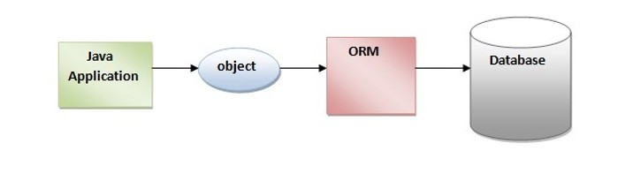
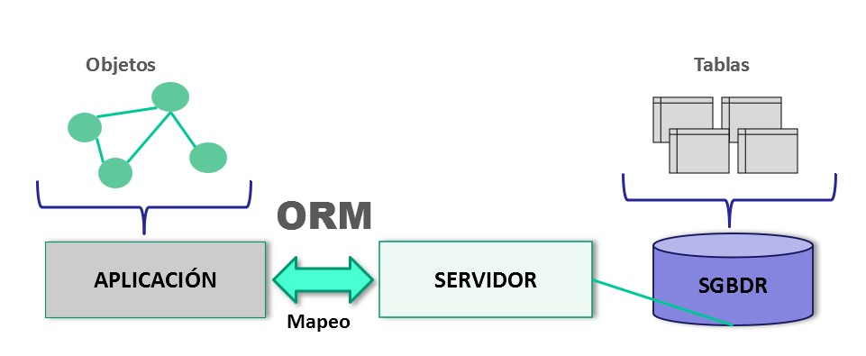
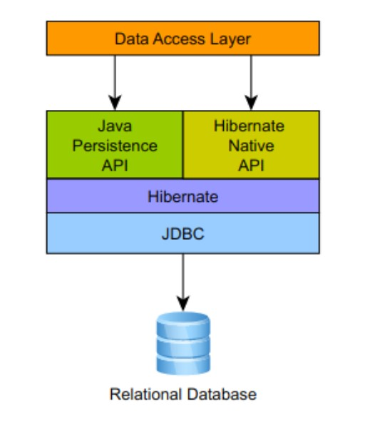
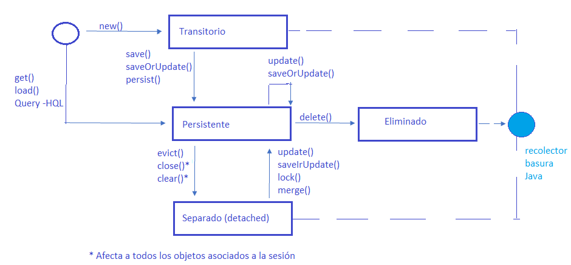

# UNIDAD 3. Acceso a datos con herramientas ORM (Hibernate y Java)

## Introducción y objetivos

Este tema trata del acceso a datos desde aplicaciones Java utilizando herramientas ORM (Object-Relational Mapping), con especial atención a **Hibernate**. Presenta conceptos teóricos, configuración práctica, ejemplos de mapeo (XML y anotaciones), manejo de sesiones y transacciones, y buenas prácticas para consultas seguras.

Tendremos:
- Entradas: clases Java (POJO), esquema relacional (BD), archivos de configuración (Maven/Gradle, `hibernate.cfg.xml` o `persistence.xml`).
- Salidas: objetos persistidos en la base de datos; consultas que devuelven objetos/tuplas; registros en BD modificados correctamente.
- Errores manejados: fallos de conexión, errores de mapeo, violaciones de integridad, transacciones abortadas.



Objetivos:
- Comprender el mapeo objeto-relacional y las responsabilidades de un ORM.
- Instalar y configurar Hibernate en un proyecto Java.
- Definir mapeos con XML y con anotaciones.
- Implementar operaciones CRUD, consultas y transacciones de forma segura.
- Demostrar prácticas que eviten inyección SQL.

## 1. Concepto de mapeo objeto-relacional (O-R)

El mapeo O-R es la técnica que relaciona conceptos de la programación orientada a objetos (clases, atributos, asociaciones) con el modelo relacional (tablas, columnas, claves foráneas), usando un motor de persistencia. Un `ORM` automatiza la transformación entre objetos en memoria y filas en la base de datos, gestionando SQL, relaciones, y el ciclo de vida de las entidades.



## 2. Características de las herramientas ORM
- Las herramientas ORM permiten crear una capa de acceso a datos orientada a objetos. 
- El programador interactúa con esta capa de acceso persistiendo y consultando objetos.
- Las herramientas ORM soportan un lenguaje de consultas OO propio e independiente de la BD, lo que permite migrar de una BD a otra sin tocar nuestro código, solo cambiando alguna línea en algún fichero de configuración.

### Ventajas
- Reducir tiempo desarrollo software
- Abstracción de la base de datos
- Reutilización
- Permiten la producción de mejor código
- Son independientes del SGBD
- Usan un lenguaje propio para consultas

### Inconvenientes
Las aplicaciones son más lentas debido a que las consultas a la BD:
- Usan primero el lenguaje propio de la herramienta para generar las instrucciones de consulta. 
- Se transforman las instrucciones del lenguaje propio al lenguaje SQL.
- Se mapean los objetos usados en el lenguaje propio a las columnas y tablas de la base de datos.
- En la respuesta del servidor del SGBD, se transforman los resultados en objetos.


## 3. Herramientas ORM más utilizadas

- Hibernate (muy usado en el ecosistema Java, implementación de JPA y ampliaciones propias).
- EclipseLink (implementación de JPA).
- OpenJPA.
- MyBatis (no es un ORM completo; es un mapper SQL semiautomático, útil cuando se necesita control sobre SQL).

En este tema nos centramos en `Hibernate` (y en `JPA` cuando sea relevante).
* **Hibernate** es la herramienta ORM más popular para Java. Se trata de un *framework* para Java.
* Es de código abierto. También tiene una distribución para `.NET`.
* Con **Hibernate** no se usará SQL para acceder a los datos sino que el **propio motor de Hibernate** construirá esas consultas por nosotros.
* Tiene un lenguaje HQL para acceder a datos mediante POO.
  
[](https://hibernate.org/)

**Hibernate y JPA**
* **JPA (Java Persistence API)** es una especificación mientras que Hibernate es un framework.
* **JPA** es un documento en el cual se especifican los principios básicos de gestión de la capa de persistencia en el mundo de Java EE
* **Hibernate** es un framework que gestiona la capa de persistencia a través de ficheros xml o a través de anotaciones. 
* **Hibernate implementa JPA** (además de otras especificaciones)
* **Hibernate** implementa como parte de su código la especificación de **JPA**
* Puede usarse **Hibernate** para construir una capa de persistencia apoyándose en las definiciones y reglas de la especificación **JPA**, aunque no es obligatorio.
* **Hibernate** es mucho más grande que la especificación de **JPA** y añade más funcionalidades.



* Usaremos principalmente JPA en nuestras aplicaciones. 
* Nos proporciona:
    * Utilidades para especificar cómo nuestros objetos se relacionan con la base de datos (a través de anotaciones).
    * La API para realizar operaciones CRUD: javax.persistence.EntityManager
    * Lenguaje para realizar consultas: JPQL

:computer: Práctica guiada-Primer Proyecto Hibernate

## 4. Instalación de una herramienta ORM. Configuración.

Ejemplo mínimo (Maven): añadir dependencias en `pom.xml` (Hibernate + driver JDBC):

```xml
<!-- Dependencias mínimas (ejemplos según enfoque) -->
<!-- A) Hibernate nativo (Session/SessionFactory) -->
<dependency>
  <groupId>org.hibernate.orm</groupId>
  <artifactId>hibernate-core</artifactId>
  <version>7.2.0.CR1</version>
</dependency>
<!-- Driver JDBC para MariaDB/MySQL -->
<dependency>
  <groupId>org.mariadb.jdbc</groupId>
  <artifactId>mariadb-java-client</artifactId>
  <version>3.5.6</version>
</dependency>

<!-- B) JPA (persistence.xml + EntityManager) -->
<dependency>
  <groupId>jakarta.persistence</groupId>
  <artifactId>jakarta.persistence-api</artifactId>
  <version>3.1.0</version>
</dependency>
<!-- Hibernate como proveedor JPA (hibernate-core incluye el soporte JPA en versiones modernas) -->
<dependency>
  <groupId>org.hibernate.orm</groupId>
  <artifactId>hibernate-core</artifactId>
  <version>7.2.0.CR1</version>
</dependency>
```

Configuración clásica Nativa con `hibernate.cfg.xml` (ubicación típica: `src/main/resources/hibernate.cfg.xml`):

```xml
<?xml version='1.0'?>
<hibernate-configuration>
  <session-factory>
    <property name="hibernate.connection.driver_class">com.mysql.cj.jdbc.Driver</property>
    <property name="hibernate.connection.url">jdbc:mysql://localhost:3306/mi_bd?useSSL=false</property>
    <property name="hibernate.connection.username">usuario</property>
    <property name="hibernate.connection.password">clave</property>
    <property name="hibernate.dialect">org.hibernate.dialect.MySQL8Dialect</property>
    <property name="hibernate.show_sql">true</property>
    <property name="hibernate.hbm2ddl.auto">validate</property>
    <!-- mapping entries (si se usan ficheros .hbm.xml)
      Ejemplo: una entrada <mapping> por cada fichero .hbm.xml en el classpath, por ejemplo:
      <mapping resource="ejemplo/enativo/persona.hbm.xml"/>
      <mapping resource="ejemplo/enativo/direccion.hbm.xml"/>
      <mapping resource="ejemplo/enativo/telefono.hbm.xml"/>
         
      Nota: el valor de "resource" es la ruta relativa al classpath / al paquete dentro del JAR.
      En un proyecto Maven coloca los .hbm.xml en `src/main/resources`; por ejemplo,
      si el fichero está en `src/main/resources/ejemplo/enativo/persona.hbm.xml` la entrada será
      `ejemplo/enativo/persona.hbm.xml`.
    -->
  </session-factory>
</hibernate-configuration>
```

Configuración para proyectos modernos con JPA se suele usar `persistence.xml` o configuración a través de Spring Boot.

Configuración JPA con `persistence.xml`

```xml
<persistence xmlns="https://jakarta.ee/xml/ns/persistence"
             xmlns:xsi="http://www.w3.org/2001/XMLSchema-instance"
             xsi:schemaLocation="https://jakarta.ee/xml/ns/persistence https://jakarta.ee/xml/ns/persistence/persistence_3_0.xsd"
             version="3.0">
  <persistence-unit name="miPU" transaction-type="RESOURCE_LOCAL">
    <provider>org.hibernate.jpa.HibernatePersistenceProvider</provider>
    <!-- Añadir una entrada <class> por cada entidad del modelo, por ejemplo:
      <class>com.ejemplo.model.Persona</class>
      <class>com.ejemplo.model.Direccion</class>

    -->
    <properties>
      <property name="jakarta.persistence.jdbc.driver" value="org.mariadb.jdbc.Driver"/>
      <property name="jakarta.persistence.jdbc.url" value="jdbc:mariadb://localhost:3306/mi_bd?useSSL=false"/>
      <property name="jakarta.persistence.jdbc.user" value="usuario"/>
      <property name="jakarta.persistence.jdbc.password" value="clave"/>
      <property name="hibernate.dialect" value="org.hibernate.dialect.MariaDBDialect"/>
      <property name="hibernate.hbm2ddl.auto" value="validate"/>
      <property name="hibernate.show_sql" value="true"/>
    </properties>
  </persistence-unit>
</persistence>
```

**Observaciones**:
- El dialecto (`hibernate.dialect`) debe coincidir con el SGBD usado (MySQL, MariaDB, PostgreSQL, Oracle, SQL Server, H2, etc.). Es importante para que Hibernate genere SQL compatible.
- `hibernate.hbm2ddl.auto` controla la verificación y/o la generación automática del esquema de la base de datos a partir de los mapeos. Valores habituales:
  - `none` (o omitir la propiedad): no hace ninguna comprobación ni modificación del esquema.
  - `validate`: comprueba que las tablas/columnas existen y coinciden con los mapeos; no modifica la base de datos. Recomendado en entornos de producción para detectar discrepancias sin riesgo.
  - `update`: intenta actualizar el esquema existente aplicando cambios necesarios (crear tablas/columnas nuevas, alterar columnas en algunos casos). No elimina columnas ni siempre realiza alteraciones complejas; puede generar DDL inesperado según el dialecto. Úsalo sólo en desarrollo o con mucha precaución y siempre con copias de seguridad.
  - `create`: crea el esquema desde cero en el arranque (normalmente elimina/reescribe tablas existentes). Útil para pruebas locales cuando se quiere partir de cero.
  - `create-drop`: como `create`, pero además elimina el esquema al cerrar la sesión/SessionFactory. Muy útil en suites de tests donde se necesita un esquema limpio por ejecución.

**Consejos**:
- En producción usa `validate` (o omite la propiedad) y gestiona las migraciones con herramientas dedicadas (Flyway, Liquibase) o scripts SQL controlados.
- `update` facilita desarrollo pero puede generar cambios indeseados y no cubre todos los casos (ej.: renombrados complejos). No confiar en él para cambios de esquema críticos.
- `create`/`create-drop` son convenientes para pruebas automatizadas o demos, nunca para datos reales sin respaldos.
- Si ves errores de DDL (sintaxis) al usar `update` o `create`, revisa el `hibernate.dialect` y la versión del SGBD: un dialecto incorrecto puede producir sentencias incompatibles.

## 5. Estructura de un fichero de mapeo (HBM XML). Elementos y propiedades

Ejemplo de fichero HBM (`Persona.hbm.xml`):

```xml
<?xml version="1.0"?>
<hibernate-mapping>
  <class name="com.ejemplo.model.Persona" table="persona">
    <id name="id" column="id">
      <generator class="identity"/>
    </id>
    <property name="nombre" column="nombre"/>
    <property name="edad" column="edad"/>
    <many-to-one name="direccion" class="com.ejemplo.model.Direccion" column="direccion_id"/>
    <set name="telefonos" cascade="all" inverse="true" lazy="true">
      <key column="persona_id"/>
      <one-to-many class="com.ejemplo.model.Telefono"/>
    </set>
  </class>
</hibernate-mapping>
```

Elementos clave:
- `<class>`: mapea una clase a una tabla.
- `<id>`: define la clave primaria y su generador.
- `<property>`: mapea un campo simple.
 - `<many-to-one>`: referencia desde la entidad actual a otra entidad (columna FK en la tabla actual). Representa multiplicidad muchos → uno (por ejemplo, `Persona` tiene una `Direccion`).
 - `<one-to-many>`: colección en la entidad "uno" que agrupa a muchas instancias de la entidad relacionada. En la BD la tabla "muchos" suele contener la FK. Suele mapearse en HBM con una colección (`<set>`, `<bag>`) y la clave en la tabla opuesta.
 - `<one-to-one>`: relación 1 → 1 entre dos tablas; puede implementarse mediante una FK única o una primary-key compartida según el diseño.
 - `<many-to-many>`: relación N ↔ N que se materializa con una tabla intermedia (join table). En HBM se usa una colección (`<set>`/`<bag>`) junto con `<many-to-many>` que indica la tabla/columnas de unión.
 - `<set>`: colección sin duplicados (no ordenada). Útil cuando no se quieren duplicados en la colección (por ejemplo, telefonos únicos por persona).
 - `<bag>`: colección no ordenada que permite duplicados. Es la opción por defecto si no se necesita orden ni índice.
 - `<list>`: colección ordenada que mantiene un índice (columna de posición) en la BD.
 - `<map>`: colección clave → valor mapeada a la BD, donde la clave se guarda en una columna separada.

**Notas sobre uso práctico:**
  - En relaciones bidireccionales hay que decidir el lado `inverse`/`mappedBy` que mantiene la FK para evitar inconsistencias.
  - `cascade` controla si las operaciones (persist, remove...) se propagan a las entidades relacionadas.
  - `fetch` (LAZY/EAGER) define cuándo se cargan las asociaciones; `LAZY` es la opción recomendada por defecto.
- `cascade`, `lazy`, `fetch`: controlan comportamiento de cascada y carga.

**Nota sobre HBM vs JPA**:

El formato `*.hbm.xml` es el mapeo nativo de Hibernate: está pensado para usarse con la configuración/arranque nativa (por ejemplo `hibernate.cfg.xml` y `org.hibernate.cfg.Configuration`). Hibernate como proveedor JPA puede cargar ficheros HBM si se los añades explícitamente, pero esto no forma parte de la especificación JPA y por tanto no es totalmente portable a otros proveedores.

Alternativas portables y recomendadas:
- Anotaciones JPA (`@Entity`, `@ManyToOne`, ...) — la opción más utilizada hoy en día y portable entre proveedores.
- `orm.xml` (mapeo JPA en XML) — estándar JPA, referenciado desde `persistence.xml` con `<mapping-file>...</mapping-file>`.

Cuándo usar cada cosa:
- `*.hbm.xml`: utilízalo sólo si necesitas alguna funcionalidad concreta de Hibernate o trabajas con código/ejemplos legacy que ya usan HBM.
- Anotaciones JPA / `orm.xml`: usa estas opciones en proyectos nuevos para mantener portabilidad y sencillez.

Ejemplos breves:
- Referenciar un HBM en `hibernate.cfg.xml` (nativo Hibernate):
  `<mapping resource="ejemplo/enativo/persona.hbm.xml"/>`
- Referenciar `orm.xml` en `persistence.xml` (JPA):
  `<mapping-file>META-INF/orm.xml</mapping-file>`

## 6. Mapeo basado en anotaciones (JPA/Hibernate)

Las anotaciones JPA son el enfoque más usado hoy en día. Ejemplo de clase persistente:

```java
import javax.persistence.*;
import java.util.Set;

@Entity
@Table(name = "persona")
public class Persona {

  @Id
  @GeneratedValue(strategy = GenerationType.IDENTITY)
  private Long id;

  @Column(name = "nombre", nullable = false, length = 100)
  private String nombre;

  @Column(name = "edad")
  private Integer edad;

  @ManyToOne(fetch = FetchType.LAZY)
  @JoinColumn(name = "direccion_id")
  private Direccion direccion;

  @OneToMany(mappedBy = "persona", cascade = CascadeType.ALL, orphanRemoval = true)
  private Set<Telefono> telefonos;

  // getters y setters
}
```
:computer: Hoja_02 (ejercicio 1)

**Anotaciones comunes (qué hacen):**

- `@Entity` — marca la clase como entidad persistente que será gestionada por el proveedor JPA/Hibernate.
- `@Table(name = "...")` — opcional; especifica el nombre de la tabla y parámetros de esquema/índices si se desea.
- `@Id` — indica el atributo que representa la clave primaria de la entidad.
 - `@GeneratedValue(strategy = ...)` — define la estrategia de generación de la PK (IDENTITY, SEQUENCE, TABLE, AUTO).
   Estrategias:
   - `IDENTITY`: la base de datos genera el valor automáticamente (auto-increment / identity column). Es simple y ampliamente usado en MySQL/MariaDB. Limitación: impide algunos optimizaciones de Hibernate (batch inserts) porque el id se conoce sólo tras el insert.
   - `SEQUENCE`: usa un objeto SEQUENCE del SGBD (PostgreSQL, Oracle). Más eficiente para inserciones en lote; Hibernate puede reservar/obtener valores de la secuencia sin hacer insert inmediato. Requiere que el SGBD soporte secuencias.
   - `TABLE`: simula un generador usando una tabla auxiliar que guarda el último valor (portable a SGBD que no soportan secuencias). Funciona en cualquier BD pero es menos eficiente y puede tener contención en alto volumen.
   - `AUTO`: deja que el proveedor elija la estrategia apropiada según el dialecto/BD; por ejemplo, seleccionará `SEQUENCE` si la BD lo soporta, o `IDENTITY` en otros casos.
   
   Consejos prácticos: usar `IDENTITY` para compatibilidad rápida con MySQL/MariaDB; preferir `SEQUENCE` en DB que soporten secuencias si necesitas rendimiento en inserciones masivas; evitar `TABLE` salvo por portabilidad extrema; `AUTO` es cómodo pero menos predecible.

- `@Column(name = "...", nullable = ..., length = ...)` — mapea un campo a una columna y permite configurar nombre, nulabilidad, longitud y otras propiedades de la columna.
  - `name`: permite modificar el nombre que tendrá la columna mapeada (si no se usa, será el nombre del atributo).
  - `length`: nos permite definir el número de caracteres de la columna.
  - `nullable`: nos permite indicar si la columna mapeada puede o no almacenar valores nulos.
  - `columnDefinition`: para especificar cual será el tipo de dato en la columna  mapeada.
  - `insertable`, `updatable`: Cuando se ponen a false, la columna no es considerada para esas operaciones. Útil, por ejemplo, para una columna fecha en la que se asigna en BD por defecto la fecha actual, al hacer una inserción.
- `@Embedded` y `@Embeddable`- tipos embebidos: Imaginemos que partimos de una tabla de una base de datos en la que un alumno, además del id, nombre y fecha de nacimiento tenga una calle y un número de vivienda.En **OO** podríamos tener una clase *Alumno* y una clase *Direccion*. 
  
Podemos definir nuestro modelo de clases de tal forma que mapeemos ambas clases contra la misma tabla alumnos utilizando las anotaciones de JPA `@Embedded` y `@Embeddable`.
  - *Direccion* sea una clase **Embeddable**. No es una entidad, no es persistente or sí misma.
  - *Alumno* añadimos un atributo marcado como **Embedded**
Ejemplo:
```java
@Embeddable
public class Direccion {
  private String calle;
  private String numero;
  // getters y setters
}
```
```java
@Entity
public class Alumno {
  @Id
  @GeneratedValue(strategy = GenerationType.IDENTITY)
  private Long id;
  private String nombre;
  private LocalDate fechaNacimiento;

  @Embedded
  private Direccion direccion;
  // getters y setters
}
``` 
:computer: Hoja_02 (ejercicio 2)

:pencil: Ejemplos de asociaciones

- Relaciones (anotaciones de asociación):
Las entidades pueden estar relacionadas entre ellas.
A nivel de base de datos las asociaciones se representan mediante claves externas o FOREIGN KEY.
Con JPA podemos modelarlas estas asociaciones. Pueden ser unidireccionales o bidireccionales:

  - `@ManyToOne` — (muchos → uno); la entidad actual tiene una FK hacia la entidad referenciada. Es el lado propietario de la relación.
  - `@OneToMany` — (uno → muchos); normalmente mapea una colección y suele declararse en el lado inverso con `mappedBy` que apunta al campo propietario.
  - `@OneToOne` — (uno → uno); puede implementarse con una FK única o compartiendo la PK entre tablas; usar `@JoinColumn` para indicar la columna de unión.
  - `@ManyToMany` — (muchos ↔ muchos); se materializa mediante una tabla intermedia (configurable con `@JoinTable`).

- `@JoinColumn(name = "columna_fk")` — especifica la columna de la tabla que almacena la FK para la relación (se usa en el lado propietario).
- `mappedBy` (atributo en `@OneToMany`/`@OneToOne`/`@ManyToMany`) — indica el nombre del atributo en el lado propietario; el lado que tiene `mappedBy` no mantiene la FK.
- `cascade` (ej.: `cascade = CascadeType.PERSIST`) — controla qué operaciones (PERSIST, MERGE, REMOVE, REFRESH, DETACH, ALL) se propagan a las entidades relacionadas.
- `fetch` (LAZY o EAGER) — determina la estrategia de carga de la asociación; `LAZY` retrasa la carga hasta acceso y es recomendado por defecto para colecciones.
- `orphanRemoval = true` — en colecciones, indica que entidades huérfanas (ya no referenciadas) deben eliminarse automáticamente.

Estas anotaciones pueden combinarse para definir comportamiento completo de la relación (propietario/inverso, cascada y estrategia de carga). En general, elegir `LAZY` para colecciones y controlar cascadas explícitamente evita sorpresas en producción.

Cuando mapeamos una entidad, todos sus atributos son considerados persistentes.Excepto los declarados **static y/o final** y los anotados como transitorios con `@Transient`.

Todo **atributo persistente** se mapea a una columna en una tabla de la base de datos.

**Hibernate** escoge la mejor correspondencia de tipos de datos en el SGBD para los tipos Java que hayamos usado en las entidades.


## 7. Clases persistentes
Se denomina **clase persistente** a una clase Java cuyo estado puede guardarse/recuperarse de la base de datos por el proveedor de persistencia (Hibernate). Se marca típicamente con `@Entity` (o con un <class> en HBM).

**Recomendaciones:**
- Tener un constructor sin argumentos (público o protegido): Hibernate lo crea por reflexión.
- Usar un tipo envolvente para la PK (por ejemplo `Long id`) y anotarla con `@Id` y `@GeneratedValue` cuando se genere en BD; evita tipos primitivos para la PK.
- Mantener un único modo de acceso: anotar campos (field access) o getters (property access), no mezclar ambos.
- No declarar la clase ni los métodos importantes como `final` (Hibernate puede crear proxies que extienden la clase).
- `equals` / `hashCode`: implementar basándolos en la PK cuando ésta ya está asignada; usar `instanceof` (no `getClass()`) para soportar proxies y evitar usar campos mutables.
- Evitar lógica pesada en getters, `toString()`, `equals()` o `hashCode()` (pueden disparar loads perezosos o consultas inesperadas).
- Preferir `LAZY` en colecciones y controlar la carga con `JOIN FETCH` o `EntityGraph` cuando necesites datos relacionados.
- Controlar explícitamente `cascade` (no usar `CascadeType.ALL` sin entender el impacto) y usar `orphanRemoval` sólo cuando corresponda.
- Para capas de presentación o API, usar DTOs en lugar de exponer entidades gestionadas directamente.

## 8. Sesiones; estados de un objeto
Hibernate nos ha permitido realizar la correspondencia ORM para clases de Java y para las relaciones entre ellas. Nos permite crear objetos transitorios que se han almacenado en la BD como objetos persistentes.
La clase para la que establecemos una correspondencia mediante Hibernate se llama clase persistente y podemos crear objetos persistentes instanciando la clase.

**Ciclo de vida de los objetos persistentes**:



Este ciclo de vida muestra los estados en los que puede estar los objetos persistentes, las operaciones que permiten recuperarlos, modificarlos y grabar de nuevo estas modificaciones en la BD.
Una sesión (interfaz `org.hibernate.Session`) es esencial en Hibernate porque se construye sobre una conexión a la base de datos.

Una **sesión**, junto con un gestor de entidades asociado, constituye un contexto de persistencia. El gestor de entidades (interfaz `javax.persistence.EntityManager`) lleva el control de los cambios que se realizan sobre objetos persistentes.
La interfaz `Session` es de la `API especifica de Hibernate`.

Para garantizar la portabilidad y compatibilidad con otros sistemas JPA, es preferible utilizar la interfaz `EntityManager` pertenece a la de JPA. Es posible obtener una `EntityManager` a partir de una `Session` y al revés porque hay un puente entre ambas.

Los cambios que hacemos sobre los objetos quedan reflejados en la BD porque están asociados a un contexto de persistencia.

Estados de una instancia:
- Transient (transitorio): objeto nuevo, no asociado a sesión y no existe en BD.
- Persistent (persistente): asociado a una sesión; cualquier cambio se sincroniza con la BD en flush/commit.
- Detached (desconectado): estuvo persistente, pero la sesión se cerró; cambios no se sincronizan hasta reattach.
- Removed (eliminado): marcado para borrado en la sesión.

Sesión (Hibernate `Session`) y `EntityManager` en JPA: representan la unidad de trabajo y el contexto de persistencia.

Creación típica de `SessionFactory` (Hibernate nativo):

```java
import org.hibernate.SessionFactory;
import org.hibernate.cfg.Configuration;
import org.hibernate.Session;

Configuration configuration = new Configuration().configure(); // lee hibernate.cfg.xml
SessionFactory sessionFactory = configuration.buildSessionFactory();
Session session = sessionFactory.openSession();
```
```java
// Ejemplo mínimo de uso de JPA con EntityManager
// (suponiendo persistence.xml con persistence-unit "miPU")
EntityManagerFactory emf = Persistence.createEntityManagerFactory("miPU");
EntityManager em = emf.createEntityManager();
```

## 9. Carga, almacenamiento y modificación de objetos (CRUD)

### Operaciones básicas con `Session`:
- **Crear / persistir**:

```java
try (Session session = sessionFactory.openSession()) {
  Transaction tx = session.beginTransaction();
  Persona p = new Persona();
  p.setNombre("Ana");
  session.persist(p); // ahora p pasa a estado persistent
  tx.commit();
}
```

- **Leer**:

```java
try (Session session = sessionFactory.openSession()) {
  Persona p = session.get(Persona.class, 1L); // devuelve null si no existe
}
```
- **Actualizar**:

```java
try (Session session = sessionFactory.openSession()) {
  Transaction tx = session.beginTransaction();
  Persona p = session.get(Persona.class, 1L);
  p.setEdad(30); // si p es persistent, el cambio se detecta automáticamente
  tx.commit();
}
```

- **Borrar**:

```java
try (Session session = sessionFactory.openSession()) {
  Transaction tx = session.beginTransaction();
  Persona p = session.get(Persona.class, id);
  if (p != null) session.remove(p);
  tx.commit();
}
```
Conceptos: cascada (cascade) para persistir entidades relacionadas, `orphanRemoval`, `fetch` strategies para evitar N+1.

### Operaciones básicas con JPA con EntityManager

```java
// Ejemplo mínimo de uso de JPA con EntityManager
// (suponiendo persistence.xml con persistence-unit "miPU" y entidad Persona)
EntityManagerFactory emf = Persistence.createEntityManagerFactory("miPU");
EntityManager em = emf.createEntityManager();
try {
  // INSERT (persist)
  em.getTransaction().begin();
  Persona nuevo = new Persona();
  nuevo.setNombre("Luis");
  nuevo.setEdad(35);
  em.persist(nuevo);
  em.getTransaction().commit();

  // READ (find)
  Persona encontrado = em.find(Persona.class, nuevo.getId());

  // UPDATE (merge) — útil para objetos detached
  em.getTransaction().begin();
  if (encontrado != null) {
    encontrado.setEdad(36);
    em.merge(encontrado);
  }
  em.getTransaction().commit();

  // DELETE (remove)
  em.getTransaction().begin();
  if (encontrado != null) {
    em.remove(encontrado);
  }
  em.getTransaction().commit();

} finally {
  em.close();
  emf.close();
}
```

## 10. Consultas: HQL/JPQL

La interfaz Query permite hacer consultas **HQL(Hibernate Query Language)** usando la API de Hibernate.
Vamos a ver como se puede obtener una sentencia de **Query** a partir de una instancia de **Session** mediante el método `createQuery(String consulta)` devuelve una instancia de la interfaz `org.hibernate.query.Query`

Una Query puede tener parámetros que se pueden identificar por nombre o por posición.

```java
import org.hibernate.query.Query;

// lista de objetos getResultList()
try (Session session = sessionFactory.openSession()) {
  Query<Persona> query = session.createQuery("from Persona p where p.edad > :edad", Persona.class);
  query.setParameter("edad", 18);
  List<Persona> lista = query.getResultList();
// una consulta únicamente devuelve cero o un resultado uniqueResult()

}
```


SQL nativo (usar cuando sea necesario):

```java
List<Object[]> filas = session.createNativeQuery("SELECT id, nombre FROM persona WHERE edad > :edad")
    .setParameter("edad", 18)
    .getResultList();
```

Seguridad frente a inyección SQL:
- Nunca concatenar valores de entrada directamente en la cadena de consulta.
- Usar parámetros nombrados (`:param`) o posicionales y `setParameter`.
- Validar y sanear entradas (longitud, formato) en la capa de aplicación.
- Usar cuentas de BD con privilegios mínimos.

## 11. Gestión de transacciones

Transacciones programáticas (ejemplo con Hibernate puro):

```java
try (Session session = sessionFactory.openSession()) {
  Transaction tx = session.beginTransaction();
  try {
    // operaciones
    tx.commit();
  } catch (RuntimeException e) {
    if (tx != null && tx.isActive()) tx.rollback();
    throw e;
  }
}
```

Transacciones declarativas (Spring): usar `@Transactional` sobre métodos/servicios; Spring gestiona commit/rollback automáticamente.

Buenas prácticas:
- Acortar la duración de las transacciones.
- Evitar operaciones de I/O pesadas dentro de la transacción.
- Manejar correctamente el rollback en excepciones recuperables y no recuperables.

## 12. Desarrollo de programas que utilizan ORM — ejemplo práctico mínimo

Estructura sugerida (Maven):

- `src/main/java/...` clases de entidad, DAOs o servicios.
- `src/main/resources/hibernate.cfg.xml` o `persistence.xml`.

Ejemplo rápido de servicio CRUD:

```java
public class PersonaService {
  private final SessionFactory sessionFactory;

  public PersonaService(SessionFactory sessionFactory) {
    this.sessionFactory = sessionFactory;
  }

  public Persona crear(Persona p) {
    try (Session s = sessionFactory.openSession()) {
      Transaction tx = s.beginTransaction();
      s.persist(p);
      tx.commit();
      return p;
    }
  }

  public Persona buscar(long id) {
    try (Session s = sessionFactory.openSession()) {
      return s.get(Persona.class, id);
    }
  }

  public List<Persona> buscarMayoresDe(int edad) {
    try (Session s = sessionFactory.openSession()) {
      return s.createQuery("from Persona p where p.edad > :edad", Persona.class)
          .setParameter("edad", edad)
          .getResultList();
    }
  }
}
```

## 12.1 Ejemplos comparativos: Hibernate nativo vs JPA (persistence.xml)

Para aclarar la diferencia y ofrecer un recorrido completo, a continuación verás dos caminos paralelos:

- A) Hibernate nativo: `hibernate.cfg.xml` + `SessionFactory` / `Session` (ya mostrado arriba y usado en el proyecto de ejemplo `Main`).
- B) JPA estándar: `persistence.xml` + `EntityManagerFactory` / `EntityManager` (portable entre implementaciones).

1) Configuración — archivos de ejemplo

- Hibernate nativo (ya en el tema): `src/main/resources/hibernate.cfg.xml`.

- JPA (`persistence.xml`) — crear `src/main/resources/META-INF/persistence.xml` con este contenido:

```xml
<persistence xmlns="https://jakarta.ee/xml/ns/persistence"
             xmlns:xsi="http://www.w3.org/2001/XMLSchema-instance"
             xsi:schemaLocation="https://jakarta.ee/xml/ns/persistence https://jakarta.ee/xml/ns/persistence/persistence_3_0.xsd"
             version="3.0">
  <persistence-unit name="miPU" transaction-type="RESOURCE_LOCAL">
    <provider>org.hibernate.jpa.HibernatePersistenceProvider</provider>
    <!-- Añadir una entrada <class> por cada entidad del modelo, por ejemplo:
      <class>com.example.model.Persona</class>
      <class>com.example.model.Direccion</class>
    -->
    <properties>
      <property name="jakarta.persistence.jdbc.driver" value="org.h2.Driver"/>
      <property name="jakarta.persistence.jdbc.url" value="jdbc:h2:mem:testdb;DB_CLOSE_DELAY=-1"/>
      <property name="jakarta.persistence.jdbc.user" value="sa"/>
      <property name="jakarta.persistence.jdbc.password" value=""/>
      <property name="hibernate.dialect" value="org.hibernate.dialect.H2Dialect"/>
      <property name="hibernate.hbm2ddl.auto" value="create-drop"/>
      <property name="hibernate.show_sql" value="true"/>
    </properties>
  </persistence-unit>
</persistence>
```

2) Inicio / código de arranque

- Hibernate nativo (ejemplo ya incluido en el proyecto - `Main`):

```java
Configuration cfg = new Configuration().configure();
cfg.addAnnotatedClass(Persona.class);
SessionFactory sf = cfg.buildSessionFactory();
try (Session session = sf.openSession()) { ... }
```

- JPA (nuevo ejemplo `MainJPA`):

```java
EntityManagerFactory emf = Persistence.createEntityManagerFactory("miPU");
EntityManager em = emf.createEntityManager();
em.getTransaction().begin();
Persona p = new Persona("Ana",28);
em.persist(p);
em.getTransaction().commit();
em.close();
emf.close();
```

3) Pros/cons y recomendaciones

- Usar Hibernate nativo cuando necesitas características específicas de Hibernate que no están cubiertas por JPA, o para aprender internals(cómo funciona Hibernate por dentro).

  "Aprender internals" significa estudiar y comprender los mecanismos internos del framework (no sólo su API pública). Ejemplos prácticos: cómo se construyen las sentencias SQL desde HQL/JPQL, cómo funcionan el flush y el dirty checking, el ciclo de vida de Session/SessionFactory, estrategias de caché (primer/segundo nivel), generación de DDL y el papel de los dialectos. Conocer estos detalles ayuda a diagnosticar comportamientos inesperados, optimizar rendimiento y, si hace falta, extender o personalizar partes de Hibernate.
- Usar JPA (`persistence.xml`) cuando quieras portabilidad y código contra la especificación estándar (recomendado en proyectos modernos). Con Spring Boot normalmente no necesitarás ni `persistence.xml`.

4) Cómo ejecutar ambos ejemplos en el proyecto de ejemplo

- Hibernate nativo: ya existe `Main` en `src/main/java/com/example/Main.java`. Ejecuta `mvn exec:java -Dexec.mainClass="com.example.Main"`.
- JPA: después de añadir `src/main/resources/META-INF/persistence.xml` y `src/main/java/com/example/MainJPA.java` (se crearán en el proyecto de ejemplo), ejecuta `mvn exec:java -Dexec.mainClass="com.example.MainJPA"`.

Con esto tienes en el mismo repositorio dos rutas para ver la configuración, el mapeo y la ejecución completa: una con Hibernate nativo y otra con JPA (`persistence.xml`).

## 13. Relación con los criterios de evaluación (a–g)

a) Se ha instalado la herramienta ORM.
- Evidencia: `pom.xml` con dependencias de Hibernate y driver JDBC.

b) Se ha configurado la herramienta ORM.
- Evidencia: `hibernate.cfg.xml` o `persistence.xml` con `connection.*` y `dialect`.

c) Se han definido configuraciones de mapeo.
- Evidencia: clases anotadas con `@Entity` o ficheros `.hbm.xml` en `src/main/resources`.

d) Se han aplicado mecanismos de persistencia a los objetos.
- Evidencia: uso de `Session.persist`, `merge`, `remove`, `get`.

e) Se han desarrollado aplicaciones que modifican y recuperan objetos persistentes.
- Evidencia: servicios/DAOs con operaciones CRUD y pruebas manuales o unitarias.

f) Se han desarrollado aplicaciones que realizan consultas usando SQL, implementando prácticas de seguridad para prevenir inyecciones.
- Evidencia: ejemplos con parámetros (`setParameter`), Criteria API y recomendaciones de seguridad.

g) Se han gestionado las transacciones.
- Evidencia: ejemplos de transacciones programáticas y mención del enfoque declarativo (`@Transactional`).

## 14. Cómo probar / actividad práctica propuesta

1) Crear un proyecto Maven sencillo con las dependencias anteriores.
2) Configurar `hibernate.cfg.xml` apuntando a una BD de pruebas (por ejemplo MySQL o H2 en memoria).
3) Crear entidades `Persona`, `Direccion`, `Telefono` con anotaciones.
4) Escribir una pequeña clase `Main` o tests JUnit que:
   - Inserten varias personas (persist).
   - Realicen consultas HQL y Criteria que devuelvan resultados filtrados.
   - Actualicen y borren registros dentro de transacciones con commit/rollback.
   - Prueben consultas con parámetros y verifiquen que no es posible inyectar SQL mediante concatenación.

Comandos de ejemplo (PowerShell) para crear y ejecutar un proyecto Maven local:

```powershell
# Compilar
mvn -e -DskipTests=false clean package
# Ejecutar (si hay una clase Main empaquetada)
java -jar target/mi-aplicacion.jar
```

Si se usa H2 en memoria para pruebas, la configuración es rápida y no requiere BD externa.

## 15. Buenas prácticas y rendimiento

- Usar `batch_size` y `jdbc.batch_size` para inserciones masivas.
- Revisar y ajustar estrategias de fetch (`LAZY` vs `EAGER`).
- Monitorizar consultas generadas (`hibernate.show_sql` y herramientas de perfilado).
- Usar caché de segundo nivel cuando sea pertinente y coherente.

## 16. Conclusión y referencias

Hibernate es una herramienta madura y potente para mapear modelos OO a bases de datos relacionales. Conocer su configuración, mapeos (XML y anotaciones), gestión de sesiones y transacciones, y técnicas para evitar inyección SQL permite desarrollar aplicaciones robustas y seguras.

Referencias rápidas:
- Documentación oficial Hibernate: https://hibernate.org/
- JPA specification: https://jakarta.ee/specifications/persistence/

---
